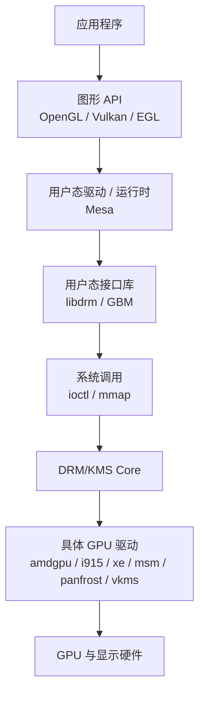

# Session 01：环境准备与图形栈总览

## 目标

这一节的目标不是进入某个具体 GPU 驱动，而是先建立 Linux GPU 驱动学习所需的整体地图。学完这一节之后，你应该知道自己后面读的代码位于整张图的什么位置，也知道用户态和内核态之间是如何衔接的。

- 明确 Linux 图形栈从应用到 GPU 的主要分层
- 理解 `Mesa`、`libdrm`、`DRM/KMS` 和具体驱动的职责边界
- 建立“后面所有 session 都在这张图上展开”的全局视角

## 核心问题

- Linux 图形栈有哪些主要层次？
- `Mesa`、`libdrm`、`DRM/KMS`、具体驱动分别负责什么？

## 学习内容

### 1. 为什么第一节先讲图形栈总览

GPU 驱动学习有一个很常见的问题：一上来就进入某个驱动目录，结果看到 `drm_ioctl.c`、`amdgpu_cs_ioctl`、`drm_mode_config`、`dma_fence` 这些名字时，不知道它们分别属于哪一层，也不知道谁在调用谁。

所以第一节最重要的事情不是记住细节，而是先知道：

- 应用到底在和谁交互
- 用户态驱动和内核驱动的边界在哪里
- 为什么 `ioctl` 和 `mmap` 会反复出现
- 后面读到的 DRM/KMS 对象为什么不是“某个驱动私有知识”，而是公共框架的一部分

这一节先建立地图，后面的 session 再一点点把地图上的每一块拆开。

### 2. 图形栈总览

### 3. 每一层到底在做什么

- 应用程序：提出绘制或计算需求。
- 图形 API：把应用需求组织成标准接口。
- 用户态驱动 / 运行时：把 API 调用转成更接近硬件的对象和命令。
- `libdrm` / GBM：封装用户态访问 DRM 设备时常见的接口。
- `ioctl` / `mmap`：用户态进入内核图形驱动的主要入口。
- DRM/KMS Core：提供 Linux 图形子系统的公共框架。
- 具体 GPU 驱动：真正管理 buffer、提交、同步、中断、显示输出。
- GPU 与显示硬件：最终执行命令并把结果输出出来。

### 4. 一条最粗的调用路径

把最粗的路径先记成下面这样就够了：

1. 应用调用 OpenGL / Vulkan / EGL 这类接口
2. 用户态驱动在 `Mesa` 里把这些接口调用翻译成对象创建、命令组织、资源管理
3. 用户态通过 `libdrm`、`ioctl`、`mmap` 等方式进入内核
4. DRM/KMS Core 负责公共对象、公共分发逻辑和显示框架
5. 具体 GPU 驱动接管真正和硬件相关的部分
6. GPU 和显示硬件执行命令并输出结果

后面你看到的大部分源码，本质上都在补全这条路径里的某一个局部。

### 5. 这一节先记住的关键概念

- `Mesa`
  常见的 Linux 开源用户态图形实现集合。后面读用户态栈时会一直碰到。
- `libdrm`
  用户态访问 DRM 设备时常用的轻量封装库。很多和驱动相关的 `ioctl` 包装都在这里。
- `DRM`
  Linux 图形设备核心子系统，很多驱动共享它提供的框架和文件接口。
- `KMS`
  DRM 里的显示模式设置和显示对象管理部分，后面会专门展开。
- `ioctl`
  用户态向驱动发送控制请求的主要方式，后面读调用链时会反复出现。
- `mmap`
  把某些设备对象或内存映射到用户态地址空间，也是图形驱动里非常常见的入口。

### 6. `Mesa`、`libdrm`、`DRM/KMS`、具体驱动怎么分工

这几个名字很容易混在一起，但它们其实不在同一层：

- `Mesa`
  主要在用户态，负责很多图形 API 的实现、shader 编译、资源管理和命令组织。
- `libdrm`
  也是用户态，但比 `Mesa` 更靠近内核接口，主要负责设备节点访问和很多 DRM `ioctl` 的轻量封装。
- `DRM/KMS`
  在内核里，提供公共图形框架、显示对象模型、文件接口和很多驱动共享的基础设施。
- 具体 GPU 驱动
  也在内核里，负责真正和硬件强相关的 buffer 管理、命令提交、中断、显示控制、地址空间管理等。

可以先用一句话记：

- `Mesa` 更偏“实现图形 API 和组织命令”
- `libdrm` 更偏“把用户态请求送进内核”
- `DRM/KMS` 更偏“提供公共内核图形框架”
- 具体驱动更偏“真正驱动这块 GPU 硬件”

### 7. 用户态和内核态的边界在哪里

后面学 GPU 驱动时，一个非常重要的分界线就是：

- 用户态负责“提出请求、组织命令、维护一部分运行时状态”
- 内核态负责“资源隔离、设备访问、同步、调度、显示控制和硬件交互”

为什么不能把所有东西都放在用户态？

- 因为硬件访问、地址空间隔离、中断处理、设备节点管理这些事情必须由内核控制。
- 因为多个进程共享 GPU 时，需要内核统一管理资源、安全和同步。
- 因为显示输出链路和很多底层对象本来就属于内核图形框架的一部分。

所以后面你读源码时，要时刻先问自己：

- 这个逻辑属于用户态，还是内核态？
- 这是公共 DRM/KMS 逻辑，还是某个驱动自己的实现？

### 8. 这些问题会在哪些后续 session 展开

这一节只先把问题挂在图上，真正展开要去后面的 session 看：

- `DRM` 和 `KMS` 的对象有哪些
  重点看 Session 09。
- `ioctl` 请求是怎么被 DRM core 分发的
  先看 Session 05，再看 Session 22。
- buffer object、GEM、TTM 分别是什么
  重点看 Session 11，后面在 Session 16 到 18 里会结合真实驱动继续出现。
- page flip、vblank、fence 分别扮演什么角色
  先看 Session 12，再看 Session 20。

## 关联 Lab

- [Lab 01：环境准备与图形栈总览](../../labs/lab-01-environment-and-stack/lab-01-environment-and-stack.md)

## 下一步

完成本节后，进入 Session 02：

- 补齐 `struct`、指针、链表、回调表这些源码阅读基础
- 开始理解为什么内核驱动大量使用 `list_head`、`container_of`、ops table
