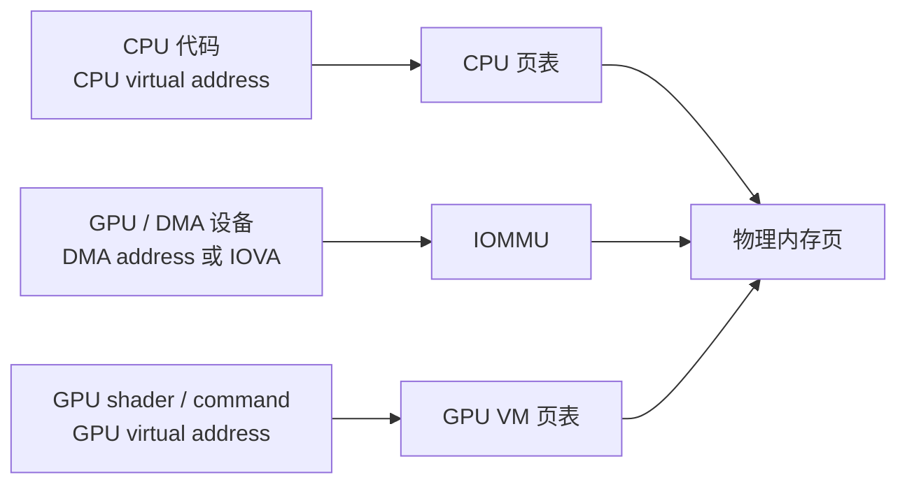

# Session 03：虚拟内存、DMA、IOMMU

## 目标

建立 GPU 驱动里的地址空间地图，理解 CPU 虚拟地址、物理地址、DMA 地址、IOMMU 映射和 GPU 虚拟地址之间的关系。

## 核心问题

- CPU 地址、物理地址、DMA 地址、GPU 地址之间是什么关系？
- IOMMU 在设备访问中扮演什么角色？
- 为什么 buffer object 后面一定会牵涉页表、pin、map、unmap 和缓存一致性？

## 学习内容

### 1. 为什么 GPU 驱动一定绕不开地址空间

在普通用户态程序里，你通常只关心一个地址：指针。

```c
void *p = malloc(4096);
memset(p, 0, 4096);
```

这段代码里的 `p` 是 CPU 虚拟地址。CPU 通过进程页表把它翻译到物理页，然后读写内存。但 GPU 驱动不能只停在这一层，因为同一块 buffer 可能同时被几类主体访问：

- CPU 要初始化数据、读取结果或做 fallback。
- GPU 要通过自己的地址空间读取顶点、纹理、页表或命令。
- DMA engine 或显示控制器可能要直接从内存取数据。
- IOMMU 可能在设备和物理内存之间再加一层地址翻译和隔离。

所以 GPU 驱动里经常不是“这块内存地址是多少”这么简单，而是要问：

- CPU 看到它的地址是什么？
- 设备发起 DMA 时用的地址是什么？
- GPU shader 或 command processor 看到的虚拟地址是什么？
- 这块内存现在是否被 pin 住，能不能迁移？
- CPU cache 和设备访问之间是否需要同步？

这就是后面 GEM、TTM、dma-buf、GPU VM、page fault 都会反复出现的根。

### 2. 先把几种地址分清楚

最容易混淆的是下面这几种地址：

- CPU virtual address
  进程或内核代码直接使用的指针，例如 `void *`、`struct page *` 映射后的地址。

- Physical address
  真实物理内存地址。内核能在特定场景下看到它，但驱动通常不应该随意把它直接交给设备。

- DMA address
  设备发起 DMA 时使用的地址。它可能等于物理地址，也可能是 IOMMU 翻译前的 IOVA。

- I/O virtual address, IOVA
  IOMMU 给设备看到的虚拟地址。设备用 IOVA 发起访问，IOMMU 再把它翻译到真实物理页。

- GPU virtual address
  GPU 自己执行命令或 shader 时看到的地址，由 GPU VM 或驱动管理的 GPU 页表解释。它和 CPU 进程虚拟地址不是同一套页表。

可以先用这张图记住它们的关系：



同一块物理页可以被多套地址系统引用。读驱动时，如果你只看到一个 `addr` 字段，不要急着下结论，要看它是 CPU 地址、DMA 地址还是 GPU VA。

### 3. DMA mapping API 在解决什么

设备不能直接拿一个 CPU 指针就开始访问内存。原因很简单：

- CPU 虚拟地址只对 CPU 页表有意义。
- 设备可能只能访问某些地址范围。
- IOMMU 可能要求先建立设备侧映射。
- cache coherent 与非 coherent 设备的同步要求不同。

Linux 用 DMA mapping API 把这些差异收起来。一个典型的思路是：

```c
struct page *page = alloc_page(GFP_KERNEL);
dma_addr_t dma;

dma = dma_map_page(dev, page, 0, PAGE_SIZE, DMA_TO_DEVICE);
if (dma_mapping_error(dev, dma))
    return -EIO;

/* 把 dma 地址写进设备描述符或命令包，设备随后用它访问内存 */
program_device_dma_address(dma);

dma_unmap_page(dev, dma, PAGE_SIZE, DMA_TO_DEVICE);
__free_page(page);
```

这段代码里最重要的不是函数名字，而是边界感：

1. CPU 分配的是 page。
2. `dma_map_page` 为某个具体 `dev` 建立设备可用的 DMA 地址。
3. 设备只应该看到 `dma_addr_t`，不是 CPU 指针。
4. 访问结束后要 `dma_unmap_page`，解除映射并完成必要同步。

如果是一组不连续页面，驱动通常会使用 scatter-gather table：

```c
struct sg_table *sgt;
int nents;

nents = dma_map_sgtable(dev, sgt, DMA_BIDIRECTIONAL, 0);
if (nents < 0)
    return nents;

/* 遍历 sgt，把每段 DMA 地址交给硬件或 GPU VM 构建逻辑 */

dma_unmap_sgtable(dev, sgt, DMA_BIDIRECTIONAL, 0);
```

真实 DRM 驱动里的 BO 往往不是一整块连续物理内存，而是一组 page 加上 `sg_table`。这也是为什么你后面会反复看到 `pages`、`sgt`、`pin`、`map`、`unmap`。

### 4. IOMMU：设备侧的地址翻译和隔离

没有 IOMMU 时，设备 DMA 往往更接近直接访问物理地址。这样做性能直接，但安全和隔离都比较弱：如果设备被错误配置，可能写到不该写的物理内存。

有 IOMMU 后，设备看到的是 IOVA。设备发起 DMA：

1. 设备把 IOVA 放到总线上。
2. IOMMU 根据这个设备所属的 domain 查询映射。
3. IOMMU 把 IOVA 翻译到真实物理页。
4. 如果没有合法映射，访问会失败，并可能产生 fault。

这带来两个重要收益：

- 隔离：不同设备可以处在不同 IOMMU domain 里。
- 灵活：驱动可以把不连续物理页映射成设备侧连续地址范围。

但要注意：IOMMU 不是 GPU VM。

- IOMMU 管的是“设备访问系统内存时”的地址翻译。
- GPU VM 管的是“GPU 执行图形/计算命令时”的虚拟地址空间。
- 在复杂 GPU 上，GPU VA 可能先经过 GPU 页表，再落到 VRAM 或 system memory；如果访问 system memory，还可能再经过 IOMMU。

把这两层分开，后面读 page fault 和显存迁移才不容易混。

### 5. Buffer object 为什么天然会牵涉映射

一个 buffer object 在驱动里通常不是“一个指针”，而是一组状态：

- 它由哪些物理页或显存页组成。
- 它当前在 system memory、GTT 还是 VRAM。
- 它是否被 CPU mmap。
- 它是否被 GPU VM 映射。
- 它是否被 display scanout 使用。
- 它能不能迁移，是否被 pin。

可以用下面这个极简结构体帮助理解：

```c
struct my_bo {
    struct drm_gem_object gem;
    struct sg_table *sgt;
    dma_addr_t dma_addr;
    u64 gpu_va;
    bool pinned;
};
```

真实驱动比这个复杂得多，但字段角色类似：

- `gem` 让它接入 DRM buffer object 框架。
- `sgt` 描述 backing pages。
- `dma_addr` 或 sg entry 里的 DMA 地址让设备能访问它。
- `gpu_va` 让 GPU 命令能引用它。
- `pinned` 决定它是否能被迁移或回收。

看到 BO 时，应该立刻想到：这个对象可能同时有 CPU 映射、DMA 映射、GPU VM 映射和用户态 handle。

### 6. Cache coherency 不要先钻太深，但要建立警觉

CPU 和设备都能访问同一块内存时，cache 一致性会变得重要。

如果平台是 cache coherent 的，设备和 CPU cache 之间由硬件保证一致性，驱动负担较小。很多 PC 平台更接近这种模型。

如果平台不是完全 coherent，驱动就必须在 CPU 和设备访问切换时做同步，例如：

```c
dma_sync_single_for_device(dev, dma, len, DMA_TO_DEVICE);
/* 设备读取数据 */
dma_sync_single_for_cpu(dev, dma, len, DMA_FROM_DEVICE);
/* CPU 读取设备写回的数据 */
```

这类函数的核心意思是：

- 给设备访问前，确保 CPU 写入已经对设备可见。
- 给 CPU 访问前，确保设备写入已经对 CPU 可见。

后面读移动 GPU、display controller 或 dma-buf 共享时，如果看到 flush、invalidate、sync，就把它放回“谁刚刚写，谁接下来读”的问题里理解。

### 7. 本节实践：追一条最小映射路径

可以从一个很小的路径开始，不要求一次读完整个显存管理系统。

建议步骤：

1. 在内核源码里搜索 `dma_map_sgtable` 或 `dma_map_sg`。
2. 找一个调用点，看它传入的 `dev` 是谁。
3. 记录它映射的是单页、一组 page，还是一个 GEM/BO 的 backing storage。
4. 找到对应的 unmap 路径。
5. 在笔记里画出“CPU 对象 -> sg_table -> DMA address -> 设备访问”的关系。

可以用下面的命令辅助定位：

```bash
rg -n "dma_map_sgtable|dma_map_sg|dma_unmap_sgtable" drivers/gpu drivers/dma-buf include/drm
```

读的时候不要只抄调用链，要顺手标注每一步发生的是“创建对象、收集页面、建立 DMA 映射、交给硬件、解除映射”中的哪一种动作。

## 建议源码入口

- `include/linux/dma-mapping.h`
- `kernel/dma/mapping.c`
- `include/linux/iommu.h`
- `drivers/iommu/`
- `include/drm/drm_gem.h`
- `include/drm/drm_gem_dma_helper.h`

## 建议输出

- 内存路径图
- DMA / IOMMU 关系笔记

## 完成标准

- 能画出 CPU、IOMMU、设备、内存之间的地址转换路径。
- 能解释 DMA mapping 和普通 CPU 指针访问为什么不是同一件事。
- 能说清 GPU 驱动为什么不能只关心“malloc 出来的一块内存”。

## 关联 Lab

- [Lab 03：虚拟内存、DMA、IOMMU](../../labs/lab-03-virtual-memory-dma-iommu/README.md)

## 下一步

进入 Session 04，把地址空间继续放进真实设备模型里，看设备如何被发现、绑定驱动并产生中断。
