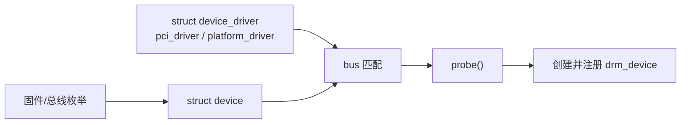

# Session 04：PCIe、中断与设备模型

## 目标

理解 Linux 如何发现一个 GPU 设备、如何把它绑定到驱动，以及硬件事件如何通过中断回到 CPU。

## 核心问题

- 一个 GPU 设备是如何被内核发现并绑定驱动的？
- 中断如何把硬件事件传回 CPU？
- PCIe 设备驱动和 platform 设备驱动在入口形态上有什么差异？

## 学习内容

### 1. 先把 device、driver、bus 的关系讲清楚

Linux 设备模型里最基本的三件事是：

- device：系统里真实存在或被固件描述出来的设备。
- driver：能控制某类设备的一段内核代码。
- bus：负责把 device 和 driver 匹配起来的机制。

GPU 可以挂在不同总线上。桌面 PC 上常见的是 PCIe GPU，移动 SoC 上常见的是 platform device。它们最终都可能注册成 DRM 设备，但最开始被发现和绑定的入口不一样。

可以先把绑定过程想成这样：



所以读一个 GPU 驱动的第一步，经常不是找渲染逻辑，而是找它的 `probe`。

### 2. PCIe GPU 的入口长什么样

PCIe 驱动通常会声明一张设备 ID 表，再注册一个 `struct pci_driver`：

```c
static const struct pci_device_id my_gpu_pci_ids[] = {
    { PCI_DEVICE(PCI_VENDOR_ID_EXAMPLE, 0x1234) },
    { }
};
MODULE_DEVICE_TABLE(pci, my_gpu_pci_ids);

static int my_gpu_probe(struct pci_dev *pdev,
                        const struct pci_device_id *ent)
{
    int ret;

    ret = pcim_enable_device(pdev);
    if (ret)
        return ret;

    ret = pcim_iomap_regions(pdev, BIT(0), "my_gpu");
    if (ret)
        return ret;

    pci_set_master(pdev);

    return my_gpu_drm_register(pdev);
}

static struct pci_driver my_gpu_pci_driver = {
    .name = "my_gpu",
    .id_table = my_gpu_pci_ids,
    .probe = my_gpu_probe,
    .remove = my_gpu_remove,
};
module_pci_driver(my_gpu_pci_driver);
```

这段代码体现了 PCIe GPU 初始化的常见顺序：

1. 总线枚举到设备。
2. PCI core 用 vendor/device id 匹配驱动。
3. 驱动 enable 设备。
4. 驱动映射 BAR，得到 MMIO 寄存器地址。
5. 驱动设置 DMA 能力和 bus mastering。
6. 驱动创建私有设备对象，并注册 DRM device。

真实的 `amdgpu`、`i915`、`xe` 远比这复杂，但入口形态仍然围绕 `pci_driver`、ID 表和 probe。

### 3. BAR、MMIO 和寄存器访问

PCIe 设备会暴露 BAR。对 GPU 驱动来说，BAR 里常见内容包括：

- MMIO 寄存器空间。
- doorbell 页面。
- framebuffer aperture 或 VRAM 可见窗口。

驱动把 BAR 映射到内核虚拟地址后，通常用 `readl`、`writel` 或驱动封装宏访问寄存器：

```c
void __iomem *mmio = pcim_iomap_table(pdev)[0];
u32 value;

value = readl(mmio + REG_STATUS);
writel(value | REG_ENABLE, mmio + REG_CONTROL);
```

这里的 `__iomem` 很重要。它提醒你：这个地址不是普通内存，不能用普通指针读写。MMIO 访问可能有顺序要求、副作用和平台差异。

读 GPU 驱动时，如果看到类似 `RREG32`、`WREG32`、`intel_uncore_read`、`xe_mmio_read32`，本质上都可以先理解成“驱动对硬件寄存器的封装访问”。

### 4. Platform GPU 的入口长什么样

移动 GPU 或 SoC 显示控制器常常不是 PCIe 设备，而是由 device tree 或 ACPI 描述出来的 platform device。

典型入口像这样：

```c
static const struct of_device_id my_gpu_of_match[] = {
    { .compatible = "vendor,my-gpu" },
    { }
};
MODULE_DEVICE_TABLE(of, my_gpu_of_match);

static int my_gpu_platform_probe(struct platform_device *pdev)
{
    struct resource *res;
    void __iomem *mmio;
    int irq;

    mmio = devm_platform_ioremap_resource(pdev, 0);
    if (IS_ERR(mmio))
        return PTR_ERR(mmio);

    irq = platform_get_irq(pdev, 0);
    if (irq < 0)
        return irq;

    return my_gpu_drm_register(pdev, mmio, irq);
}

static struct platform_driver my_gpu_platform_driver = {
    .probe = my_gpu_platform_probe,
    .remove_new = my_gpu_platform_remove,
    .driver = {
        .name = "my_gpu",
        .of_match_table = my_gpu_of_match,
    },
};
module_platform_driver(my_gpu_platform_driver);
```

和 PCIe 相比，platform GPU 更常见这些内容：

- 从 device tree 取 MMIO resource、IRQ、clock、reset、power domain。
- 通过 runtime PM 控制电源。
- 需要和 IOMMU、devfreq、interconnect、firmware 配合。

所以 `msm`、`panfrost` 这类驱动里，设备模型和电源管理比纯 PCIe 入口更显眼。

### 5. 中断：硬件怎样把事件告诉 CPU

GPU 做完事情后，不会让 CPU 一直轮询。更常见的是硬件触发中断，驱动在中断处理里读取状态并唤醒等待者。

一个极简 IRQ 路径可以写成：

```c
static irqreturn_t my_gpu_irq(int irq, void *data)
{
    struct my_gpu *gpu = data;
    u32 status = readl(gpu->mmio + REG_IRQ_STATUS);

    if (!status)
        return IRQ_NONE;

    writel(status, gpu->mmio + REG_IRQ_CLEAR);

    if (status & IRQ_JOB_DONE)
        dma_fence_signal(gpu->current_fence);

    if (status & IRQ_VBLANK)
        drm_crtc_handle_vblank(&gpu->crtc.base);

    return IRQ_HANDLED;
}
```

真实驱动会更复杂：可能要分 top half 和 threaded IRQ，可能要处理多个 ring、多个 engine、多个 display pipe，也可能只是记录状态后把重活丢给 workqueue。

但主线很稳定：

1. 硬件置位状态寄存器。
2. 中断控制器通知 CPU。
3. 驱动读取并清除中断状态。
4. 驱动更新软件状态，例如 signal fence、记录错误、处理 vblank。
5. 等待中的用户态或内核线程被唤醒。

### 6. devm_* 为什么在驱动初始化里很常见

`devm_*` 是 device-managed resource API。它的好处是资源跟随 `struct device` 生命周期自动释放，减少 error path 里的手工清理。

例如：

```c
irq = platform_get_irq(pdev, 0);
if (irq < 0)
    return irq;

ret = devm_request_irq(&pdev->dev, irq, my_gpu_irq, 0,
                       dev_name(&pdev->dev), gpu);
if (ret)
    return ret;
```

如果 probe 后面失败，或者设备被移除，devm 框架会帮助释放 IRQ。读源码时看到 `devm_kzalloc`、`devm_request_irq`、`devm_platform_ioremap_resource`，要把它们理解成“把资源生命周期挂到 device 上”。

### 7. 从设备入口过渡到 DRM device

无论是 PCIe 还是 platform，GPU 驱动最终通常会创建一个 DRM 设备并注册到 DRM core。

抽象流程大致是：

```c
gpu = devm_kzalloc(dev, sizeof(*gpu), GFP_KERNEL);

drm = drm_dev_alloc(&my_drm_driver, dev);
if (IS_ERR(drm))
    return PTR_ERR(drm);

gpu->drm = drm;
drm->dev_private = gpu;

ret = drm_dev_register(drm, 0);
if (ret)
    return ret;
```

新内核和具体驱动的写法会有差异，有的驱动会把 `struct drm_device` 嵌入自己的私有结构体，有的会通过 helper 完成更多初始化。你读的时候抓住三件事：

- 私有设备对象在哪里分配。
- `struct drm_device` 如何初始化并关联私有对象。
- 最后在哪里调用 `drm_dev_register` 或等价路径把设备暴露出去。

### 8. 本节实践：读 probe 时画顺序图

建议从一个具体驱动里选择入口，例如：

```bash
rg -n "struct pci_driver|module_pci_driver|struct platform_driver|module_platform_driver" drivers/gpu/drm
```

然后画出下面这些节点：

1. 驱动注册入口。
2. 设备匹配表。
3. probe 函数。
4. MMIO/BAR 或 platform resource 获取。
5. IRQ 获取和注册。
6. DRM device 分配和注册。
7. remove 或 error path 里的清理动作。

完成这张图以后，你再读后面的 `ioctl`、GEM、KMS 初始化，会知道它们是挂在哪个设备对象下面的。

## 建议源码入口

- `include/linux/pci.h`
- `drivers/pci/`
- `drivers/gpu/drm/amd/amdgpu/amdgpu_drv.c`
- `drivers/gpu/drm/i915/i915_pci.c`
- `drivers/gpu/drm/msm/msm_drv.c`
- `kernel/irq/`

## 建议输出

- 设备初始化流程图
- PCIe 与中断机制笔记

## 完成标准

- 能指出一个 DRM 驱动的 probe 入口。
- 能解释设备资源、MMIO BAR 和 IRQ 注册之间的关系。
- 能把“硬件完成事件 -> 中断 -> 驱动处理 -> fence 或状态更新”串成一条粗路径。

## 关联 Lab

- [Lab 04：PCIe、中断与设备模型](../../labs/lab-04-pcie-interrupt-device-model/README.md)

## 下一步

进入 Session 05，开始追用户态请求如何通过 `ioctl` 和 `mmap` 进入这些驱动入口。
