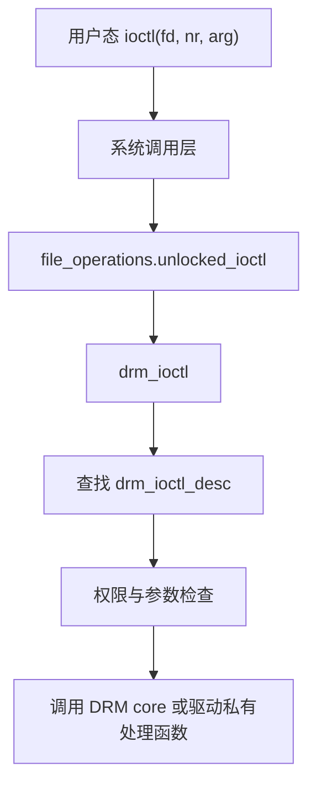

# Session 05：`ioctl`、`mmap` 与驱动基础

## 目标

建立用户态到内核态的基本调用视角，理解 `ioctl` 和 `mmap` 为什么是 Linux 图形驱动最重要的接口形态。

## 核心问题

- 为什么图形驱动高度依赖 `ioctl`？
- `mmap` 如何把设备内存或对象映射到用户态？
- DRM core 如何把一个通用 ioctl 分发到具体驱动实现？

## 学习内容

### 1. 为什么 GPU 驱动大量使用 ioctl

普通文件接口适合表达 `read`、`write` 这类线性数据流，但 GPU 驱动要表达的是一组复杂控制请求：

- 创建 buffer object。
- 导入或导出 dma-buf。
- 提交 command buffer。
- 创建 GPU VM。
- 查询设备能力。
- 设置 KMS mode、plane、property。

这些请求往往有结构化参数、返回 handle 或 fd，还要经过权限检查和对象查找。`ioctl` 正好适合表达“对一个设备文件发起一个带参数的控制命令”。

用户态访问 DRM 设备时，通常先打开设备节点：

```c
int fd = open("/dev/dri/renderD128", O_RDWR | O_CLOEXEC);
if (fd < 0)
    return -1;
```

常见节点大致可以这样理解：

- `/dev/dri/card*`
  传统 DRM primary node，常用于 KMS/display 相关操作，也可能涉及认证和 master 权限。

- `/dev/dri/renderD*`
  render node，主要用于渲染和计算提交，不提供 KMS 控制能力，适合普通应用使用。

这个 `fd` 后面会成为所有 ioctl、mmap、poll、event 读取的入口。

### 2. file_operations 是用户态进内核的门

Linux 设备文件最终会落到一组 `file_operations`：

```c
static const struct file_operations drm_stub_fops = {
    .owner          = THIS_MODULE,
    .open           = drm_open,
    .release        = drm_release,
    .unlocked_ioctl = drm_ioctl,
    .compat_ioctl   = drm_compat_ioctl,
    .mmap           = drm_gem_mmap,
    .poll           = drm_poll,
    .read           = drm_read,
};
```

不同驱动可能会提供自己的 `fops`，但 DRM core 的入口角色很稳定：

- `open`：创建或初始化 `drm_file`，也就是这个进程打开 DRM 设备后的 file 私有上下文。
- `release`：释放这个 file 持有的对象、事件、上下文。
- `ioctl`：分发控制命令。
- `mmap`：把 GEM object 或设备相关内存映射到用户态。
- `poll`/`read`：处理 page flip event、vblank event 等用户态事件。

读驱动时要特别关注 `struct drm_file`。很多“每个进程独有”的状态都会挂在这里，例如 handle 表、事件列表、驱动私有 file context。

### 3. DRM ioctl 是怎么分发的

一个用户态 ioctl 可以抽象成：

```c
struct drm_version version = {0};

if (ioctl(fd, DRM_IOCTL_VERSION, &version) < 0)
    perror("DRM_IOCTL_VERSION");
```

进入内核后，大致会经过：



DRM ioctl 分两类：

- DRM core ioctl：由 DRM 公共框架处理，例如 version、get resources、mode 相关接口。
- Driver private ioctl：由具体驱动定义，例如 buffer 创建、命令提交、VM 操作。

驱动私有 ioctl 常常通过类似下面的表绑定编号和处理函数：

```c
static const struct drm_ioctl_desc my_ioctls[] = {
    DRM_IOCTL_DEF_DRV(MY_CREATE_BO, my_create_bo_ioctl,
                      DRM_RENDER_ALLOW),
    DRM_IOCTL_DEF_DRV(MY_SUBMIT, my_submit_ioctl,
                      DRM_RENDER_ALLOW),
};

static const struct drm_driver my_drm_driver = {
    .driver_features = DRIVER_GEM | DRIVER_RENDER,
    .ioctls = my_ioctls,
    .num_ioctls = ARRAY_SIZE(my_ioctls),
};
```

所以你追一个 ioctl 时，要做四步：

1. 找用户态宏或 `libdrm` 包装。
2. 找 ioctl 编号对应的内核表项。
3. 找 handler 函数。
4. 看 handler 如何查对象、复制参数、调用驱动内部逻辑。

### 4. copy_from_user 和 __user 的边界意义

ioctl 参数来自用户态，内核不能把它当成可信内核指针。你会看到类似：

```c
static int my_create_bo_ioctl(struct drm_device *dev, void *data,
                              struct drm_file *file)
{
    struct drm_my_create_bo *args = data;

    if (!args->size)
        return -EINVAL;

    return my_bo_create(dev, file, args->size, &args->handle);
}
```

在 DRM ioctl 框架里，很多固定大小参数已经由 core 复制到内核缓冲区，handler 里的 `data` 指向内核内存。但如果参数里还有用户态指针，例如数组地址，驱动仍然需要显式处理：

```c
struct drm_my_submit *args = data;
struct my_user_chunk __user *chunks =
    u64_to_user_ptr(args->chunks);

if (copy_from_user(local_chunks, chunks, size))
    return -EFAULT;
```

看到 `__user` 时，要马上意识到：这是跨越用户态/内核态边界的地址，必须通过安全访问 API。

### 5. handle、object 和 fd 不要混在一起

DRM/GEM 里常见三个引用层次：

- 内核对象：真正的 `struct drm_gem_object` 或驱动 BO。
- GEM handle：某个 `drm_file` 内部的整数句柄，只在这个 DRM fd 上有意义。
- dma-buf fd：跨进程、跨驱动共享 buffer 的文件描述符。

极简创建流程可以想成：

```c
struct drm_gem_object *obj;
u32 handle;

obj = my_gem_object_create(dev, size);
if (IS_ERR(obj))
    return PTR_ERR(obj);

ret = drm_gem_handle_create(file, obj, &handle);
drm_gem_object_put(obj);
if (ret)
    return ret;

args->handle = handle;
```

这里有一个容易忽略的点：handle 属于 `file`。另一个进程不能直接拿这个数字访问同一个对象，除非通过 flink、dma-buf fd 或其他共享机制建立引用。

### 6. mmap 和 fake offset

GPU buffer 经常需要让 CPU 访问。用户态会调用 `mmap`，但它通常不是直接映射“某个物理地址”，而是通过 DRM/GEM 的 offset 管理找到对应对象。

用户态大致像这样：

```c
uint64_t offset;
void *map;

/* 先通过 ioctl 取得这个 BO 对应的 mmap offset */
ioctl(fd, DRM_IOCTL_MY_MMAP_OFFSET, &offset);

map = mmap(NULL, size, PROT_READ | PROT_WRITE, MAP_SHARED, fd, offset);
if (map == MAP_FAILED)
    perror("mmap");
```

内核侧会根据 `offset` 在 DRM/GEM 的 VMA offset manager 里找对象，然后建立 CPU 映射。这个 offset 通常叫 fake offset，因为它不是普通文件里的真实字节偏移，而是用来索引 GEM 对象的标识。

读 mmap 路径时，重点看：

- offset 是哪个 ioctl 返回给用户态的。
- `mmap` 入口是不是 `drm_gem_mmap` 或驱动包装。
- 驱动是否提供 `gem_prime_mmap`、`mmap`、`vmap` 或 page fault handler。
- CPU cache 同步要求在哪里处理。

### 7. 一条最小 ioctl 阅读路线

建议先用简单 core ioctl 建立分发直觉：

```bash
rg -n "DRM_IOCTL_VERSION|drm_version" drivers/gpu/drm include/drm
```

然后再找一个驱动私有 ioctl，例如：

```bash
rg -n "DRM_IOCTL_DEF_DRV|\\.ioctls|num_ioctls" drivers/gpu/drm
```

阅读时可以按下面模板记录：

```text
ioctl 名称：
用户态入口：
宏编号：
内核表项：
handler：
需要的权限 flag：
输入参数结构体：
输出参数字段：
涉及的核心对象：
失败时常见 errno：
```

只要能把一个 ioctl 按这个模板讲清楚，你就已经掌握了 GPU 驱动最重要的入口阅读方法。

## 建议源码入口

- `drivers/gpu/drm/drm_file.c`
- `drivers/gpu/drm/drm_ioctl.c`
- `drivers/gpu/drm/drm_gem.c`
- `drivers/gpu/drm/drm_prime.c`
- `include/drm/drm_ioctl.h`
- `include/drm/drm_file.h`

## 建议输出

- 用户态到内核态调用链笔记
- `ioctl` / `mmap` 速记

## 完成标准

- 能解释 `DRM_IOCTL_VERSION` 这类 ioctl 如何被 DRM core 处理。
- 能找到一个驱动私有 ioctl 表，并说明它如何绑定处理函数。
- 能说清 `mmap` 在 buffer object 暴露给用户态时解决什么问题。

## 关联 Lab

- [Lab 05：`ioctl`、`mmap` 与驱动基础](../../labs/lab-05-ioctl-mmap-driver-basics/README.md)

## 下一步

进入 Session 06，把接口路径和 GPU 实际要执行的图形流水线联系起来。
