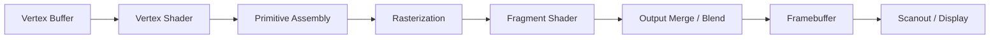
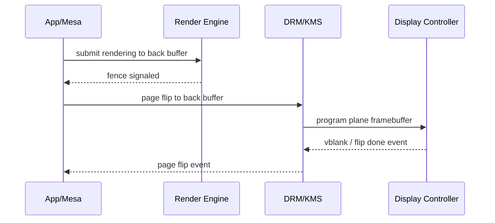

# Session 06：GPU 图形流水线

## 目标

理解 GPU 图形流水线的主要阶段，以及驱动为什么要围绕 shader、buffer、texture、framebuffer、同步和显示输出组织资源。

## 核心问题

- 图形流水线从顶点到输出经历了什么？
- 驱动为什么需要管理 framebuffer、page flip 和同步？
- 用户态驱动和内核驱动分别参与流水线的哪些部分？

## 学习内容

### 1. 先把图形流水线看成一条数据加工链

应用想画一个三角形，GPU 并不是“直接画三角形”。它会把一批输入数据经过多个阶段加工，最后写入 framebuffer。

最典型的简化图是：



每一层都对应驱动要管理的一类资源或状态：

- vertex buffer：顶点数据放在哪里，GPU 怎么读。
- shader：用户态驱动如何编译、上传、绑定。
- pipeline state：光栅化、深度测试、混合、格式等状态。
- texture / sampler：采样资源和访问方式。
- framebuffer：渲染结果写到哪里。
- fence / event：怎么知道这一批命令执行完。
- page flip：怎么把结果切到屏幕上。

所以图形流水线不是和内核 DRM/KMS 完全分开的知识。它最终会落到 buffer、命令提交、同步和显示输出这些驱动主题上。

### 2. 从一个最小绘制调用开始看

以 OpenGL 风格伪代码为例：

```c
glBindBuffer(GL_ARRAY_BUFFER, vertex_bo);
glVertexAttribPointer(0, 3, GL_FLOAT, GL_FALSE, stride, 0);

glUseProgram(shader_program);
glBindFramebuffer(GL_FRAMEBUFFER, framebuffer);

glDrawArrays(GL_TRIANGLES, 0, 3);
```

用户态 API 看起来很高层，但用户态驱动最终要把它翻译成更接近硬件的内容：

- 哪些 buffer object 要被 GPU 访问。
- shader 二进制或中间表示要放在哪里。
- 当前 pipeline state 是什么。
- draw command 参数是什么。
- 渲染目标 framebuffer 是哪个 BO。
- 依赖哪些 fence，执行后产生哪个 fence。

内核驱动通常不理解 OpenGL 语义里的“画三角形”。它更关心的是：这批命令是否合法，引用的 buffer 是否存在，地址空间是否配置好，提交到哪个 engine，完成后怎么 signal。

### 3. Shader 是程序，pipeline state 是配置

可以用 CPU 程序做类比：

- shader 像运行在 GPU 执行单元上的小程序。
- pipeline state 像这次运行时的配置和固定功能开关。
- resource binding 描述 shader 能访问哪些 buffer、texture、sampler。

一个非常简化的 vertex shader 可能长这样：

```glsl
#version 450

layout(location = 0) in vec3 in_position;

void main()
{
    gl_Position = vec4(in_position, 1.0);
}
```

fragment shader 可能长这样：

```glsl
#version 450

layout(location = 0) out vec4 out_color;

void main()
{
    out_color = vec4(0.2, 0.6, 1.0, 1.0);
}
```

用户态驱动需要把 shader 编译成目标 GPU 能理解的指令，并把它和 pipeline state 一起写进命令流。内核驱动一般不会参与 shader 编译，但它会参与 shader 二进制所在 BO 的管理和命令提交。

### 4. Command buffer：把 API 调用变成 GPU 能执行的命令

现代 GPU 通常不是应用每调一次 API 就立刻让硬件执行一次，而是把许多状态设置和绘制命令组织进 command buffer。

一个高度简化的命令流可以想成：

```c
emit_set_vertex_buffer(cmd, vertex_bo_gpu_va);
emit_set_shader(cmd, vertex_shader_gpu_va, fragment_shader_gpu_va);
emit_set_render_target(cmd, framebuffer_gpu_va, width, height, format);
emit_draw(cmd, 3);
emit_end(cmd);
```

这里的 `*_gpu_va` 提醒你：GPU 命令引用的通常不是 CPU 指针，而是 GPU 地址空间里的地址。于是这又和 Session 03 的 GPU VM、BO 映射连起来了。

提交时，内核侧看到的可能只是：

```c
struct drm_my_submit args = {
    .cmd_bo = cmd_bo_handle,
    .nr_buffers = nr_bos,
    .buffers = user_ptr_to_buffer_list,
};

ioctl(fd, DRM_IOCTL_MY_SUBMIT, &args);
```

驱动要验证这些 BO、建立依赖、把命令排进 ring 或 scheduler，然后返回 fence。

### 5. Framebuffer、scanout buffer 和 page flip

渲染结束后，结果通常写入某个 framebuffer 对应的 buffer。要显示出来，还要让显示控制器 scanout 这个 buffer。

这里要区分两个动作：

- Rendering
  GPU 3D/compute engine 把像素写进一个 render target。

- Scanout
  display controller 按显示时序从 framebuffer 读像素并输出到显示器。

page flip 是把当前正在显示的 framebuffer 切到另一个 framebuffer。它通常要和 vblank 配合，避免屏幕撕裂。



后面 Session 20 会专门讲 page flip 和显示输出，这里先建立直觉：画完并不等于显示出来，显示链路还有自己的对象、时序和事件。

### 6. 用户态驱动和内核驱动在流水线里的分工

可以先粗略分成这样：

- 用户态驱动负责 API 状态跟踪、shader 编译、pipeline 创建、资源绑定、命令构建。
- 内核驱动负责 buffer 生命周期、GPU 地址空间、安全校验、命令提交、调度、同步、中断和显示控制。

这个分工不是绝对的。不同 GPU、不同 API 和不同驱动会把部分工作放在不同层。但对阅读 Linux 开源栈来说，这个粗分工很有用：

- 看 shader 编译和 draw call 组织，多去 Mesa。
- 看 BO、VM、submit、fence、IRQ，多去内核 DRM 驱动。
- 看显示对象和 modeset，多去 DRM/KMS。

### 7. 本节实践：把一次 draw 拆成驱动关心的问题

不需要真的实现 OpenGL。你可以拿下面这段伪代码做拆解：

```c
create_vertex_buffer();
compile_shaders();
create_framebuffer();
record_draw_commands();
submit();
wait_fence();
page_flip();
```

每一行都写下它最终可能落到哪些驱动对象：

```text
create_vertex_buffer -> GEM/BO, GPU VA, mmap
compile_shaders     -> shader BO, command buffer
create_framebuffer  -> drm_framebuffer, plane-compatible format
record_draw_commands -> command buffer, relocation/bind table
submit              -> ioctl, scheduler, ring, fence
wait_fence          -> dma_fence, syncobj, poll/event
page_flip           -> KMS plane/crtc, vblank, event
```

这一练习的目的不是掌握完整图形 API，而是让你看到：图形流水线每一步最后都会变成驱动里的对象和路径。

## 建议源码入口

- Mesa 中目标驱动的 `src/gallium/drivers/` 或 `src/intel/`、`src/amd/` 相关目录。
- `libdrm` 中目标驱动的 ioctl 包装。
- Linux DRM 中的 GEM、KMS、atomic 和 vblank 相关文件。

## 建议输出

- 图形流水线图
- 关键阶段说明笔记

## 完成标准

- 能画出从顶点到 framebuffer 的主要阶段。
- 能说明哪些部分主要由用户态驱动组织，哪些部分需要内核驱动配合。
- 能把 framebuffer、page flip 和 vblank 放回“最后显示出来”这条路径里。

## 关联 Lab

- [Lab 06：GPU 图形流水线](../../labs/lab-06-graphics-pipeline/lab-06-graphics-pipeline.md)

## 下一步

进入 Session 07，把图形命令扩展到计算模型、queue、ring 和 doorbell。
