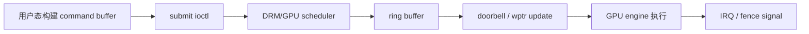

# Session 07：GPU 计算模型与队列

## 目标

理解 GPU 如何组织计算任务，以及 queue、ring buffer、command buffer、doorbell 和 User-Mode Queue 在命令提交里各自扮演什么角色。

## 核心问题

- GPU 如何执行计算任务？
- graphics / compute / copy queue 有什么差异？
- command buffer 被提交后，驱动究竟要把它放到哪里、通知谁？

## 学习内容

### 1. GPU 计算模型先从“很多线程一起跑”理解

CPU 更擅长少量复杂控制流，GPU 更擅长大量相似工作并行执行。计算 API 里常见的 dispatch 可以理解成：把一个大的问题拆成很多 work item，再按 workgroup 组织起来交给 GPU。

以 OpenCL/CUDA 风格的概念来说：

- work item / thread：最小执行单元。
- workgroup / block：一组线程，共享部分资源。
- warp / wavefront / wave：硬件实际调度的一批线程。
- SIMD / SIMT：多个 lane 用相同或相近指令处理不同数据。

一个极简 compute shader 可以这样写：

```glsl
#version 450

layout(local_size_x = 64) in;

layout(std430, binding = 0) buffer Data {
    uint values[];
};

void main()
{
    uint i = gl_GlobalInvocationID.x;
    values[i] = values[i] * 2;
}
```

这段 shader 背后，用户态驱动要准备 buffer、descriptor、shader binary 和 dispatch command。内核驱动则要保证这些资源能被 GPU 访问，并把命令送到合适的 engine。

### 2. Queue、ring、command buffer 不是同一个东西

这几个词经常一起出现，但层次不同：

- Command buffer
  一段已经编码好的 GPU 命令，描述“要做什么”。

- Queue
  逻辑上的提交队列，表示任务进入哪个执行通道。

- Ring buffer
  硬件或驱动使用的环形命令队列，通常由 read pointer / write pointer 管理。

- Doorbell
  一种通知硬件“队列里有新工作”的机制，常见形式是写 MMIO 或 doorbell page。

- Scheduler
  软件调度层，负责依赖、优先级、超时和 job 生命周期。

可以先用图连起来：



读驱动时，先判断一个变量代表的是哪一层，不要把所有“队列”都理解成同一种结构。

### 3. Graphics、compute、copy queue 的差异

现代 GPU 往往有多类 engine：

- graphics engine：处理图形流水线命令，也可能支持部分 compute。
- compute engine：处理通用计算 dispatch。
- copy / DMA engine：负责内存拷贝、清零、迁移等工作。
- video engine：负责编码/解码等媒体任务。

驱动提交时要把 job 放到合适的 ring 或 queue。一个简化选择逻辑可能像这样：

```c
switch (args->engine_class) {
case MY_ENGINE_GRAPHICS:
    ring = gpu->gfx_ring;
    break;
case MY_ENGINE_COMPUTE:
    ring = gpu->compute_ring;
    break;
case MY_ENGINE_COPY:
    ring = gpu->sdma_ring;
    break;
default:
    return -EINVAL;
}
```

不同 engine 可以并行工作，但它们之间必须通过 fence 或同步对象表达依赖。例如 copy engine 先把数据搬到 VRAM，compute engine 后续才能读取。

### 4. 一次提交拆开看

一次 command submission 大致分为：

1. 用户态构建命令。
2. 用户态把 BO 列表、命令 buffer、同步输入输出通过 ioctl 交给内核。
3. 内核查找 handle，验证对象和权限。
4. 内核建立 GPU VM 映射或确认映射有效。
5. 内核创建 job，并挂上输入依赖 fence。
6. scheduler 在依赖满足后把 job 推给硬件 ring。
7. 驱动更新 write pointer 或写 doorbell。
8. GPU 执行完成后产生中断。
9. 驱动 signal fence，唤醒等待者。

简化的内核结构可能像这样：

```c
struct my_job {
    struct drm_sched_job base;
    struct dma_fence *done;
    struct my_ring *ring;
    struct my_bo *cmd_bo;
    u64 gpu_va;
};
```

这又回到了 Session 02 的对象嵌入：驱动自己的 job 里嵌入公共调度器对象，然后通过回调接入 DRM scheduler。

### 5. Doorbell 的直觉

doorbell 可以理解成“通知硬件看队列”的铃。软件把命令写进队列后，需要告诉 GPU 有新工作了。常见做法是更新 ring write pointer，然后写一个 MMIO 或 doorbell 地址：

```c
ring->wptr += emitted_dw;
writel(ring->wptr, ring->doorbell);
```

真实驱动里会有内存屏障、缓存同步、wptr/rptr 包装、doorbell index 等细节。初学时先记住：

- command buffer 描述任务。
- ring 存放或引用任务。
- write pointer 表示软件写到了哪里。
- doorbell 让硬件知道应该来取新命令。

### 6. User-Mode Queue 的意图

传统提交路径里，每次提交都要进内核，内核验证并把工作推给硬件。User-Mode Queue 的大方向是：在保证隔离和权限的前提下，让用户态更直接地维护部分队列状态，从而减少提交开销。

但它并不意味着内核消失。内核仍然需要负责：

- 创建和授权队列。
- 管理地址空间和隔离。
- 处理 fault、hang、reset。
- 回收资源。
- 在必要时调度或抢占。

所以看到 UMQ、user queue、doorbell mmap 这类设计时，不要理解成“用户态随便控制硬件”，而是理解成“内核建立受控通道，用户态在通道内更低开销地提交”。

### 7. 本节实践：画一条 submit 路径

选择一个驱动入口，例如：

```bash
rg -n "submit|cs_ioctl|gem_submit|drm_sched_job" drivers/gpu/drm/amd drivers/gpu/drm/msm drivers/gpu/drm/panfrost
```

按下面模板记录：

```text
用户态 ioctl：
内核 handler：
提交参数结构体：
BO 查找位置：
GPU VA 或 VM 处理位置：
job 结构体：
scheduler entity：
ring/queue：
doorbell 或 wptr 更新：
fence signal 位置：
```

这个模板会在 Session 15、18、22 反复用到。

## 建议源码入口

- `drivers/gpu/drm/scheduler/`
- `drivers/gpu/drm/amd/amdgpu/amdgpu_ring*`
- `drivers/gpu/drm/amd/amdgpu/amdgpu_cs.c`
- `drivers/gpu/drm/msm/msm_gem_submit.c`
- `drivers/gpu/drm/panfrost/panfrost_job.c`

## 建议输出

- 计算模型笔记
- command buffer / queue 关系图

## 完成标准

- 能解释 queue、ring、command buffer、doorbell 不是同一个概念。
- 能说明 graphics / compute / copy queue 的职责差异。
- 能把一次提交拆成“构建命令、排队、通知硬件、等待完成”几个阶段。

## 关联 Lab

- [Lab 07：GPU 计算模型与队列](../../labs/lab-07-compute-model-and-queues/lab-07-compute-model-and-queues.md)

## 下一步

进入 Session 08，把用户态 Mesa、`libdrm` 和内核 DRM 的分工连起来。
