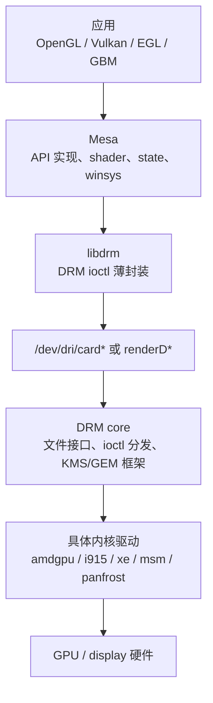

# Session 08：Mesa、libdrm、DRM 关系

## 目标

理解应用、Mesa、`libdrm`、DRM core 和具体内核驱动之间的分层关系，并知道用户态和内核态各自保存哪些状态。

## 核心问题

- 谁负责 API 实现，谁负责 ioctl 封装，谁负责真正驱动硬件？
- 用户态和内核态各自保存哪些状态？
- 为什么很多 GPU 驱动问题必须同时看 Mesa、`libdrm` 和内核？

## 学习内容

### 1. 为什么很多问题必须同时看用户态和内核态

Linux 开源图形栈不是一个单一驱动文件，而是一组分层协作的组件。一个渲染问题可能发生在：

- 应用错误使用 API。
- Mesa 状态跟踪或 shader 编译出问题。
- `libdrm` ioctl 参数封装有误。
- 内核驱动 BO、VM、submit、sync 处理出问题。
- KMS/display 路径格式、modifier、vblank 或 page flip 出问题。

所以学习 GPU 驱动不能只看 `drivers/gpu/drm/`。你至少要知道用户态大概在做什么，内核态接到的参数从哪里来。

### 2. 分层关系再画一遍



可以先用一句话记：

- Mesa 更像“把图形/计算 API 变成 GPU 资源和命令”的地方。
- `libdrm` 更像“帮用户态按内核 ABI 发 ioctl”的地方。
- DRM core 更像“公共内核图形框架和分发层”。
- 具体驱动更像“真正管理硬件、内存、提交和显示”的地方。

### 3. Mesa 大概负责哪些状态

Mesa 内部很大，不要求一开始就读全。先知道它常见职责：

- API state tracking：把 OpenGL/Vulkan/EGL/GBM 的状态变更记录下来。
- shader compile：把 GLSL、NIR、SPIR-V 等转换到目标 GPU 指令或中间格式。
- resource management：创建 texture、buffer、render target 等资源。
- winsys：和窗口系统、DRM、buffer allocation、present 路径对接。
- command building：把 draw/dispatch/state change 编码成 GPU command buffer。

一个 draw call 在 Mesa 侧可能变成：

```text
API state -> Mesa state object -> shader variant -> resource binding -> command buffer
```

到了内核侧，它可能已经只是一个 submit ioctl，里面带着 BO 列表、命令 buffer、同步对象和 engine 信息。

### 4. libdrm 是薄封装，不是完整驱动

`libdrm` 经常做的是把 C 函数参数填进内核 ABI 结构体，然后调用 ioctl。

一个典型封装可以抽象成：

```c
int drm_my_create_bo(int fd, uint64_t size, uint32_t *handle)
{
    struct drm_my_create_bo args = {
        .size = size,
    };
    int ret;

    ret = drmIoctl(fd, DRM_IOCTL_MY_CREATE_BO, &args);
    if (ret)
        return ret;

    *handle = args.handle;
    return 0;
}
```

所以读 `libdrm` 时，不要期待它实现复杂调度。它更重要的价值是：

- 告诉你用户态传给内核的结构体是什么。
- 告诉你 ioctl 编号是什么。
- 告诉你 handle、fd、flags 在用户态如何组织。
- 帮你从应用/Mesa 追到内核 ABI。

### 5. 用户态对象和内核对象怎样关联

用户态不能直接持有内核指针，所以它通常用 handle、fd 或 id 引用内核对象：

```text
用户态 resource object
    -> GEM handle
        -> drm_file 的 handle table
            -> struct drm_gem_object / driver BO
```

KMS 对象也是类似：

```text
用户态看到 connector_id / crtc_id / plane_id
    -> DRM object id
        -> struct drm_connector / drm_crtc / drm_plane
```

这就是为什么你在用户态日志里看到的常常是 `handle=3`、`fb_id=42`、`plane_id=31`，而内核源码里操作的是结构体指针。中间的映射由 DRM core 和具体驱动维护。

### 6. 从 GBM/EGL 到 KMS 的一条常见显示路径

很多简单 Linux 图形程序会用 GBM/EGL 创建可渲染 buffer，再用 KMS 显示。粗略路径如下：

```text
gbm_bo_create()
    -> 分配可 scanout 的 buffer
EGL / GL render
    -> GPU 写入 buffer
gbm_bo_get_fd() 或 handle
    -> 获取可传递给 KMS 的引用
drmModeAddFB2()
    -> 创建 DRM framebuffer
drmModeAtomicCommit() 或 drmModePageFlip()
    -> 显示到 plane/crtc
```

这条路径会同时碰到：

- Mesa/EGL：创建上下文和渲染。
- GBM：分配可被 KMS 使用的 BO。
- `libdrm`: modeset/page flip ioctl 封装。
- 内核 DRM/KMS：framebuffer、plane、crtc、atomic commit。

理解这条路径，后面读 page flip 和 display 时会轻松很多。

### 7. 本节实践：从一个 libdrm 函数追到内核

建议从 KMS 相关函数入手，因为路径比较直观：

```bash
rg -n "drmModeAddFB2|drmModeAtomicCommit|drmIoctl" libdrm
rg -n "DRM_IOCTL_MODE_ADDFB2|DRM_IOCTL_MODE_ATOMIC" drivers/gpu/drm include/uapi/drm
```

记录下面几项：

```text
用户态函数：
调用的 ioctl 宏：
传入的 uapi 结构体：
内核 core handler：
涉及的 DRM 对象：
具体驱动是否有回调：
```

这一步的价值是打通“用户态封装函数”和“内核处理函数”之间的距离。以后遇到复杂 submit ioctl，也按同样方法追。

## 建议源码入口

- `libdrm/xf86drm.c`
- `libdrm/xf86drmMode.c`
- `libdrm/amdgpu/`
- Mesa 的目标驱动 winsys 目录。
- `drivers/gpu/drm/drm_ioctl.c`

## 建议输出

- 用户态图形栈总结
- 分层职责说明

## 完成标准

- 能说明 Mesa、`libdrm`、DRM core、具体驱动各自负责什么。
- 能找到一个 `libdrm` ioctl 包装，并追到内核端入口。
- 能区分“用户态对象”和“内核对象”之间通过 handle 或 fd 关联的方式。

## 关联 Lab

- [Lab 08：Mesa、libdrm、DRM 关系](../../labs/lab-08-mesa-libdrm-drm/README.md)

## 下一步

进入 Session 09，正式展开 DRM/KMS 的对象模型。
