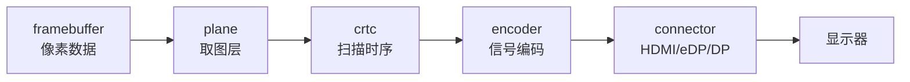

# Session 09：DRM/KMS 对象模型

## 目标

掌握 `drm_device`、connector、encoder、crtc、plane、framebuffer、mode 和 property 等 KMS 关键对象。

## 核心问题

- 这些对象之间的关系是什么？
- KMS 为什么要拆成这些对象？
- 一次 modeset 或 page flip 到底需要哪些对象一起参与？

## 学习内容

### 1. KMS 对象模型在解决什么问题

KMS 的全称是 Kernel Mode Setting。它负责在内核里表达和控制显示拓扑：哪些显示器接上了，哪个显示控制器负责扫描输出，哪个 plane 显示哪个 framebuffer，当前分辨率和刷新率是什么。

一开始可以把显示路径想成：



真实硬件可能有多个 connector、多个 plane、多个 crtc，连接关系也可能受硬件限制。KMS 对象模型就是用一组标准对象把这些关系描述出来。

### 2. drm_device 和 mode_config 是对象入口

`struct drm_device` 是一张 DRM 设备的核心对象。KMS 相关对象通常挂在它的 `mode_config` 下面。

极简结构可以这样理解：

```c
struct drm_device {
    struct drm_mode_config mode_config;
    const struct drm_driver *driver;
    struct device *dev;
};

struct drm_mode_config {
    struct list_head connector_list;
    struct list_head crtc_list;
    struct list_head plane_list;
    struct list_head property_list;
};
```

真实结构体字段更多，但阅读方向很明确：

- 找 `drm_device`，就能找到这张 DRM 设备的公共入口。
- 找 `mode_config`，就能找到 KMS 对象集合。
- 找对象初始化函数，就能知道这个驱动暴露了哪些 connector、crtc、plane。

### 3. connector、encoder、crtc、plane、framebuffer 分别是什么

这几个对象很容易混，建议先用职责来记：

- connector
  代表外部连接点，例如 HDMI、DisplayPort、eDP。它负责检测连接状态、读取 EDID、暴露可用 mode。

- encoder
  代表把像素流编码成某种输出信号的硬件块。现代驱动里它有时不再是你最常操作的对象，但仍然是拓扑的一部分。

- crtc
  代表一条扫描输出时序管线，负责 mode timing、vblank、page flip 等显示时序核心。

- plane
  代表一个可以被扫描输出的图层。primary plane 通常是主图层，cursor plane 用于鼠标光标，overlay plane 用于视频或 UI 叠加。

- framebuffer
  代表一块像素 buffer 的 KMS 视图，包含格式、尺寸、pitch、modifier 和底层 GEM BO 引用。

可以用一句话串起来：

```text
framebuffer 提供像素，plane 选择怎样取这块像素，crtc 决定按什么时序扫出去，encoder/connector 把它送到显示器。
```

### 4. 为什么 property 很重要

KMS 对象不是只有固定字段。很多可变状态通过 property 表达，例如：

- connector 的 link status、colorspace、scaling mode。
- plane 的 FB_ID、CRTC_ID、SRC_X、SRC_Y、CRTC_X、CRTC_Y。
- crtc 的 MODE_ID、ACTIVE。
- rotation、alpha、zpos、HDR metadata 等扩展能力。

atomic modeset 里，用户态本质上是在提交“一组对象 property 的新状态”。这就是为什么 property 是 KMS/atomic 的核心语言。

用户态设置 plane 的简化过程可以这样理解：

```c
drmModeAtomicReq *req = drmModeAtomicAlloc();

drmModeAtomicAddProperty(req, plane_id, prop_fb_id, fb_id);
drmModeAtomicAddProperty(req, plane_id, prop_crtc_id, crtc_id);
drmModeAtomicAddProperty(req, plane_id, prop_crtc_x, 0);
drmModeAtomicAddProperty(req, plane_id, prop_crtc_y, 0);
drmModeAtomicAddProperty(req, plane_id, prop_crtc_w, width);
drmModeAtomicAddProperty(req, plane_id, prop_crtc_h, height);

drmModeAtomicCommit(fd, req, DRM_MODE_ATOMIC_NONBLOCK, user_data);
```

内核侧会把这些 property 写入对应对象的 state，然后进入 atomic check/commit。

### 5. 对象 ID 和结构体指针的关系

用户态看到的是整数 ID：

```text
connector_id = 73
crtc_id      = 45
plane_id     = 31
fb_id        = 80
```

内核里操作的是结构体：

```c
struct drm_connector *connector;
struct drm_crtc *crtc;
struct drm_plane *plane;
struct drm_framebuffer *fb;
```

DRM core 维护 ID 到对象的映射。读 ioctl 代码时，如果看到 `drm_mode_object_find`、`drm_framebuffer_lookup`、`drm_plane_find` 这类函数，就把它理解成“从用户态 ID 找回内核对象”。

### 6. 一个最小 KMS 驱动会初始化哪些东西

非常简化的初始化顺序可能像这样：

```c
drm_mode_config_init(dev);

drm_universal_plane_init(dev, &priv->primary,
                         possible_crtcs,
                         &plane_funcs,
                         formats, nr_formats,
                         modifiers,
                         DRM_PLANE_TYPE_PRIMARY,
                         NULL);

drm_crtc_init_with_planes(dev, &priv->crtc,
                          &priv->primary,
                          NULL,
                          &crtc_funcs,
                          NULL);

drm_connector_init(dev, &priv->connector,
                   &connector_funcs,
                   DRM_MODE_CONNECTOR_VIRTUAL);

drm_connector_attach_encoder(&priv->connector, &priv->encoder);
drm_mode_config_reset(dev);
```

不同驱动会用 helper 简化这些步骤，例如 simple display pipe、atomic helper、panel/bridge helper。但对象仍然是这些。

### 7. 用 modetest 建立运行时直觉

如果环境支持，可以用 `modetest` 查看 KMS 对象：

```bash
modetest -M vkms
modetest -M amdgpu
modetest -M i915
```

重点记录：

- connectors 里有哪些 connector id、状态、mode。
- crtcs 有几个。
- planes 支持哪些 format。
- properties 列表里哪些是 atomic 关键属性。

如果跑不了命令，就阅读驱动初始化函数，手动画出对象关系图。对象模型先理解结构，后面 atomic commit 才能看懂状态变化。

## 建议源码入口

- `include/drm/drm_device.h`
- `include/drm/drm_connector.h`
- `include/drm/drm_crtc.h`
- `include/drm/drm_plane.h`
- `drivers/gpu/drm/drm_mode_config.c`
- `drivers/gpu/drm/drm_connector.c`
- `drivers/gpu/drm/drm_plane.c`

## 建议输出

- DRM/KMS 对象关系图
- 对象模型笔记

## 完成标准

- 能解释 connector、encoder、crtc、plane、framebuffer 的关系。
- 能用 `modetest` 或源码定位一个 KMS 对象集合。
- 能说明为什么 KMS 对象模型适合表达显示拓扑和状态变化。

## 关联 Lab

- [Lab 09：DRM/KMS 对象模型](../../labs/lab-09-drm-kms-object-model/lab-09-drm-kms-object-model.md)

## 下一步

进入 Session 10，继续看 atomic modeset 如何把这些对象的一次状态变化打包提交。
