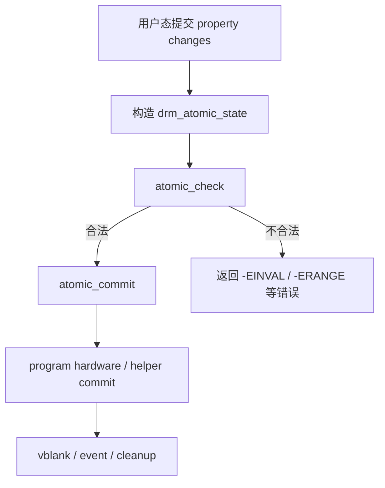

# Session 10：Atomic modeset 与 IGT 基础

## 目标

理解 atomic modeset 的基本流程，并开始使用 IGT 验证 KMS 行为和阅读测试日志。

## 核心问题

- atomic commit 解决了什么问题？
- IGT 如何帮助验证 DRM/KMS 实现？
- `atomic_check` 和 `atomic_commit` 为什么要分成两个阶段？

## 学习内容

### 1. Atomic modeset 解决了什么问题

Legacy KMS 接口更像是一组分散操作：设置 CRTC、设置 framebuffer、移动 plane、page flip。问题是显示状态往往必须整体一致。如果你先改 plane，再改 crtc，中间状态可能是不合法的。

Atomic modeset 的核心思想是：

```text
先构造一份完整的新显示状态 -> check 验证它是否整体合法 -> commit 一次性应用
```

这让驱动可以回答：

- 这个 plane 能不能放到这个 crtc 上？
- 格式、modifier、缩放比例是否被硬件支持？
- 带宽够不够？
- 多个 plane 的 zpos、alpha、rotation 是否冲突？
- 这次更新是否需要 modeset，还是只需要 page flip？

所以 atomic 不是“更复杂的设置接口”而已，它是 KMS 状态管理的中心。

### 2. Atomic state 是一份“拟提交的世界”

atomic commit 不会直接修改当前对象，而是先创建 state。

常见对象包括：

- `struct drm_atomic_state`
  一次 commit 的总状态容器。

- `struct drm_connector_state`
  connector 的目标状态，例如连接到哪个 crtc、颜色空间等。

- `struct drm_crtc_state`
  crtc 的目标 mode、active 状态、event、是否 modeset。

- `struct drm_plane_state`
  plane 的目标 framebuffer、位置、裁剪、rotation、alpha 等。

可以理解成：

```c
struct drm_atomic_state {
    struct drm_crtc_state *new_crtc_states[];
    struct drm_plane_state *new_plane_states[];
    struct drm_connector_state *new_connector_states[];
};
```

真实结构不是这么简单，但这个模型足够建立直觉：一次 commit 里可能同时改多个对象，每个对象都有 old state 和 new state。

### 3. check 和 commit 为什么要分开

atomic 流程通常分两大阶段：



check 阶段只做验证和推导，不应该真正改硬件。它通常负责：

- 补齐 derived state。
- 检查 plane/crtc/connector 组合是否合法。
- 检查格式、modifier、缩放、带宽。
- 判断是否需要 modeset。
- 准备 commit 需要的信息。

commit 阶段才真正应用状态：

- pin framebuffer。
- 等待依赖 fence。
- 编程寄存器或调用 helper。
- 安排 vblank event。
- 在完成后清理 old state。

分开以后，驱动可以先拒绝非法状态，避免硬件被写到半更新状态。

### 4. atomic helper 帮驱动做了什么

很多驱动不会从零实现 atomic 全流程，而是用 DRM atomic helper。典型回调包括：

```c
static const struct drm_plane_helper_funcs my_plane_helper_funcs = {
    .atomic_check = my_plane_atomic_check,
    .atomic_update = my_plane_atomic_update,
    .atomic_disable = my_plane_atomic_disable,
};

static const struct drm_crtc_helper_funcs my_crtc_helper_funcs = {
    .atomic_check = my_crtc_atomic_check,
    .atomic_enable = my_crtc_atomic_enable,
    .atomic_disable = my_crtc_atomic_disable,
    .atomic_flush = my_crtc_atomic_flush,
};
```

阅读时要分清：

- DRM core 负责通用 ioctl、对象查找、state 框架。
- atomic helper 负责通用 commit 编排。
- 具体驱动回调负责硬件限制检查和寄存器编程。

`vkms`、`simpledrm` 这类驱动非常适合观察 helper 如何降低实现复杂度。

### 5. IGT 不是“跑一下测试”这么简单

IGT 是 Linux 图形栈特别重要的测试工具。它的价值在于：

- 用用户态方式覆盖 DRM/KMS ABI。
- 构造大量正常和异常显示状态。
- 验证 atomic、plane、vblank、CRC、hotplug、power management 等行为。
- 让你把失败结果和内核源码路径联系起来。

一个 KMS 测试大致会做：

```c
igt_display_t display;

igt_display_require(&display, fd);
igt_display_reset(&display);

/* 选择 output、pipe、plane，创建 framebuffer */
/* 设置 plane state */
/* 调用 igt_display_commit_atomic() */
/* 检查返回值、CRC、event 或 dmesg */
```

读 IGT 时，不要只看测试名字。要记录它到底设置了哪些对象和 property，期望成功还是失败。

### 6. 从失败日志回到源码

IGT 失败时，建议按这个顺序分析：

1. 测试名和 subtest 名是什么。
2. 失败是 `fail`、`skip`、`timeout` 还是 kernel warning。
3. 涉及 connector、crtc、plane、format、modifier 中的哪些对象。
4. 用户态 ioctl 返回码是什么。
5. `dmesg` 里有没有 DRM debug、WARN、错误码。
6. 对应源码入口是 atomic check、commit、vblank event，还是驱动私有回调。

可以打开 DRM debug 辅助观察：

```bash
sudo sh -c 'echo 0x1ff > /sys/module/drm/parameters/debug'
dmesg -w
```

不同内核的 debug bit 含义可能有差异，使用时以目标内核文档和实际输出为准。

### 7. 本节实践：静态阅读一个 kms_* 测试

如果暂时不能运行 IGT，也可以先读测试：

```bash
rg -n "igt_display_commit|igt_display_commit_atomic|DRM_MODE_ATOMIC" igt-gpu-tools/tests/kms_*
```

记录模板：

```text
测试文件：
subtest：
创建了哪些 framebuffer：
使用了哪些 plane/crtc/connector：
设置了哪些 property：
期望返回值：
涉及的内核入口：
如果失败，优先看哪些 dmesg：
```

这样你跑测试时就不是“看到红绿结果”，而是能解释这个结果覆盖了 KMS 的哪一段逻辑。

## 建议源码入口

- `drivers/gpu/drm/drm_atomic.c`
- `drivers/gpu/drm/drm_atomic_helper.c`
- `include/drm/drm_atomic.h`
- `include/drm/drm_atomic_helper.h`
- `igt-gpu-tools/tests/kms_*`

## 建议输出

- atomic modeset 流程笔记
- IGT 运行记录

## 完成标准

- 能解释一次 atomic commit 的主要阶段。
- 能运行或静态分析一个 KMS IGT 测试，并说明它在验证什么。
- 能从失败日志里提取出对象、属性、返回码和可能的源码入口。

## 关联 Lab

- [Lab 10：Atomic modeset 与 IGT 基础](../../labs/lab-10-atomic-modeset-and-igt/lab-10-atomic-modeset-and-igt.md)

## 下一步

进入 Session 11，把显示对象之外的内存对象、共享对象和迁移机制补起来。
