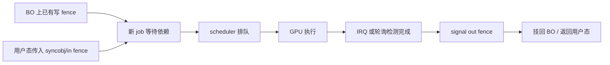

# Session 12：Fence、vblank、IRQ

## 目标

理解 GPU 任务完成、显示刷新、中断通知和等待机制之间的协作方式。

## 核心问题

- `dma_fence` 解决了什么同步问题？
- vblank 和 page flip 为什么重要？
- 中断、fence signal、等待队列和用户态事件之间如何衔接？

## 学习内容

### 1. 为什么不能只用一个 bool 表示完成

GPU 工作是异步的。CPU 提交命令后不会一直停在那里等硬件执行完，而是继续做别的事情。于是驱动需要一个对象表达“这项工作未来某个时刻会完成”。

这就是 fence 的直觉：

```text
提交 job -> 得到 fence -> 其他人可以等待 fence -> GPU 完成后 signal fence
```

如果只用 `bool done`，会遇到很多问题：

- 不知道这个完成事件属于哪条时间线。
- 不能自然表达多个 job 的顺序。
- 不能被其他子系统共享等待。
- 不能挂回 buffer 的 reservation object。
- 不能和 poll、syncobj、dma-buf 等机制协作。

`dma_fence` 是 Linux 图形和 DMA 共享生态里的通用完成原语。

### 2. dma_fence 的几个核心概念

一个 fence 可以简化理解成：

```c
struct dma_fence {
    const struct dma_fence_ops *ops;
    spinlock_t *lock;
    u64 context;
    u64 seqno;
    unsigned long flags;
};
```

关键字段直觉：

- context
  表示一条时间线。同一个 context 里的 seqno 可以比较先后。

- seqno
  表示这条时间线上的序号。

- signal
  表示这个 fence 对应的异步工作已经完成。

- wait
  等待这个 fence 被 signal。

一个极简使用模型：

```c
struct dma_fence *f = my_submit_job(job);

ret = dma_fence_wait(f, true);
if (ret)
    return ret;

dma_fence_put(f);
```

驱动内部会在硬件完成路径调用：

```c
dma_fence_signal(job->fence);
```

真实驱动常常通过 scheduler fence、syncobj、reservation object 间接使用 fence。

### 3. 提交、依赖和完成

一次 GPU submit 通常不只是产生一个 fence，还要等待已有 fence：



这就是为什么显存管理和同步分不开。一个 BO 是否能被读写，取决于之前访问它的 GPU 工作是否完成。

### 4. vblank 是显示时序里的关键边界

显示控制器不断按照刷新率扫描 framebuffer。vblank 是一帧扫描结束到下一帧开始之间的垂直消隐区间。

很多显示更新喜欢放在 vblank 附近完成，因为这样可以避免撕裂：

```text
当前帧扫描中 -> 等待 vblank -> 切换 framebuffer/plane state -> 下一帧使用新内容
```

KMS 里 page flip event 往往和 vblank 联系很紧：

- 用户态请求 page flip 或 atomic commit。
- 内核安排在安全时机更新 plane/crtc。
- vblank 到来后，驱动确认 flip 生效。
- DRM core 给用户态发送 event。

这也是为什么 vblank 不只是“显示器刷新”知识，而是 page flip、timestamp、event、测试稳定性的基础。

### 5. IRQ、threaded IRQ、workqueue 如何配合

中断处理通常要快，不能在硬中断上下文里做太重的事情。因此驱动常见几种分工：

- hard IRQ handler：读取状态、ack 中断、记录必要信息。
- threaded IRQ：在可睡眠上下文里做更多处理。
- workqueue：把复杂恢复、reset、日志收集延后执行。

简化代码：

```c
static irqreturn_t my_irq_handler(int irq, void *data)
{
    struct my_gpu *gpu = data;
    u32 status = readl(gpu->mmio + IRQ_STATUS);

    if (!status)
        return IRQ_NONE;

    writel(status, gpu->mmio + IRQ_CLEAR);

    if (status & IRQ_JOB_DONE)
        my_gpu_handle_job_done(gpu);

    if (status & IRQ_VBLANK)
        drm_crtc_handle_vblank(&gpu->crtc);

    return IRQ_HANDLED;
}
```

`my_gpu_handle_job_done` 里可能会读取硬件 seqno，找出完成的 job，并 signal 对应 fence。

### 6. syncobj：用户态可见的同步容器

`dma_fence` 是内核里的完成对象。用户态不能直接拿内核指针，所以 DRM 提供 syncobj 这样的用户态可见同步对象。

简化理解：

```text
用户态 syncobj handle
    -> 内核 drm_syncobj
        -> 指向某个 dma_fence 或 fence chain
```

Vulkan 等 API 会大量使用同步对象。内核驱动则把它们转换成 submit 的输入依赖或输出 fence。

读 submit ioctl 时，如果看到 `in_syncobj`、`out_syncobj`、`sync_file`、`timeline`，都要放回 fence 模型里。

### 7. 一条完整完成路径

把本节主线串起来：

```text
用户态提交 command buffer
    -> 内核创建 job 和 fence
    -> scheduler 等待依赖后提交到 ring
    -> GPU 执行
    -> 硬件产生完成中断
    -> IRQ handler 读取完成状态
    -> 驱动 signal dma_fence
    -> 等待者被唤醒
    -> 用户态 wait / poll / event 返回
```

显示路径类似，但完成点经常是 vblank 或 flip done：

```text
atomic/page flip commit
    -> 安排 framebuffer 切换
    -> vblank 到来
    -> 驱动处理 vblank
    -> page flip event 发送给用户态
```

### 8. 本节实践：找 signal fence 的地方

可以从这些关键词开始：

```bash
rg -n "dma_fence_signal|drm_crtc_handle_vblank|drm_send_event|drm_syncobj" drivers/gpu/drm drivers/dma-buf
```

记录模板：

```text
完成事件来源：IRQ / vblank / scheduler callback / polling
fence 类型：
signal 函数：
等待者是谁：
是否关联 BO reservation：
是否向用户态发送 event：
错误或 timeout 时走哪条路径：
```

这一节完成后，你应该能看到“提交”和“完成”不是两段独立代码，而是一条由 fence、IRQ、vblank 和 event 串起来的闭环。

## 建议源码入口

- `drivers/dma-buf/dma-fence.c`
- `include/linux/dma-fence.h`
- `drivers/gpu/drm/drm_vblank.c`
- `drivers/gpu/drm/drm_irq.c`
- `drivers/gpu/drm/drm_syncobj.c`
- `drivers/gpu/drm/scheduler/`

## 建议输出

- 同步机制笔记
- fence / IRQ / vblank 关系图

## 完成标准

- 能解释 fence 为什么比“一个布尔完成位”更适合 GPU 异步工作。
- 能画出 vblank、page flip 和用户态事件之间的基本关系。
- 能指出一个 fence signal 或 vblank 处理的源码入口。

## 关联 Lab

- [Lab 12：Fence、vblank、IRQ](../../labs/lab-12-fence-vblank-irq/README.md)

## 下一步

进入 Session 13，从 `vkms` 这个最适合入门的 DRM 驱动开始读真实实现。
