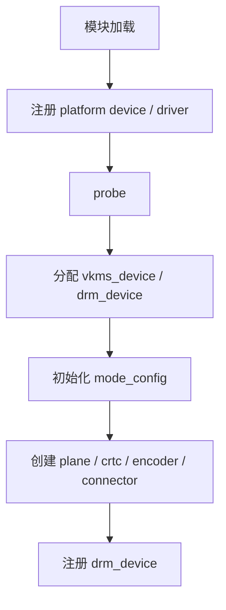

# Session 13：阅读 `vkms`

## 目标

从 `vkms` 这个虚拟 KMS 驱动切入，理解一个最小 DRM/KMS 驱动如何注册、初始化对象并接入 atomic helper。

## 核心问题

- `vkms` 是如何注册 DRM 设备的？
- 哪些对象和回调构成了它的最小实现？
- 为什么 `vkms` 很适合作为第一个完整阅读的 DRM 驱动？

## 学习内容

### 1. 为什么第一个完整驱动选 vkms

`vkms` 是 virtual KMS。它不驱动真实显示硬件，而是在内核里模拟一个 KMS 设备。正因为没有复杂硬件初始化，它特别适合作为第一个完整阅读对象：

- 能看到 DRM device 如何注册。
- 能看到 connector、crtc、plane 等 KMS 对象如何创建。
- 能看到 atomic helper 如何接管大量通用流程。
- 能看到 vblank、CRC、composition 这些显示测试能力。
- 不会被 PCIe、固件、电源管理、真实寄存器细节打断。

换句话说，`vkms` 是一张“去掉硬件噪声的 KMS 骨架图”。

### 2. 从模块入口读起

阅读 `vkms` 时，先找模块初始化和设备注册，而不是先看 composer。

可以用：

```bash
rg -n "module_|platform_driver|platform_device|probe|drm_dev_register" drivers/gpu/drm/vkms
```

你要找的是这条粗路径：



读到这里时，先把每一步写在笔记里。不要急着理解每个 helper 的内部实现，先确定 `vkms` 自己负责了哪些动作，DRM core/helper 负责了哪些动作。

### 3. KMS 对象在 vkms 里如何落地

Session 09 里学过的对象，在 `vkms` 里都能找到对应实现：

```text
struct vkms_device
    -> struct drm_device drm
    -> struct vkms_output output

struct vkms_output
    -> connector
    -> encoder
    -> crtc
    -> planes
```

一个典型私有对象会嵌入 DRM 公共对象：

```c
struct vkms_plane {
    struct drm_plane base;
};

static inline struct vkms_plane *to_vkms_plane(struct drm_plane *plane)
{
    return container_of(plane, struct vkms_plane, base);
}
```

具体结构名称会随内核版本变化，但阅读方法不变：找 `struct drm_plane`、`struct drm_crtc`、`struct drm_connector` 被嵌在哪里，再找初始化函数和回调表。

### 4. vkms 怎样使用 atomic helper

`vkms` 不是自己手写完整 atomic commit 流程，而是大量使用 DRM helper。你会看到类似：

```c
static const struct drm_plane_helper_funcs vkms_plane_helper_funcs = {
    .atomic_update = vkms_plane_atomic_update,
    .atomic_check = vkms_plane_atomic_check,
};

static const struct drm_crtc_helper_funcs vkms_crtc_helper_funcs = {
    .atomic_check = vkms_crtc_atomic_check,
    .atomic_flush = vkms_crtc_atomic_flush,
};
```

阅读时问三个问题：

- 这个回调什么时候被 helper 调用？
- 回调里读取的是 old state 还是 new state？
- 它是在验证状态、更新软件对象，还是模拟硬件行为？

这会直接帮助你理解 Session 10 的 check/commit 分工。

### 5. 虚拟 vblank 和真实硬件 vblank 的差异

真实显示控制器的 vblank 来自硬件扫描时序。`vkms` 没有真实显示器，所以需要用软件方式模拟 vblank。

这带来一个很好的学习机会：

- 你能看到 DRM vblank 框架期望驱动提供什么。
- 你能看到 page flip event 如何依赖 vblank。
- 你能看到没有硬件中断时，驱动如何用 timer/hrtimer 或 worker 模拟时序。

但也要注意边界：`vkms` 能帮你理解 KMS 框架和测试语义，却不能代表真实显示硬件的带宽、PLL、link training、PSR、DSC、HDCP 等复杂问题。

### 6. Composition 和 CRC 为什么重要

`vkms` 可以模拟多个 plane 合成，并支持 CRC 相关测试。IGT 可以用 CRC 判断显示结果是否符合预期。

简化理解：

```text
plane state + framebuffer
    -> vkms composer 读取像素
    -> 生成合成结果
    -> 计算 CRC
    -> IGT 比较 CRC
```

这让 `vkms` 成为 KMS atomic、plane、CRC 测试的重要虚拟后端。读 `vkms_composer.c` 时，不需要把它当成真实 GPU 渲染器，它只是为了验证显示管线语义而做的软件合成。

### 7. 本节实践：做一份 vkms 驱动地图

建议记录下面这张表：

```text
模块入口：
platform device/driver：
probe：
私有设备结构体：
drm_device 初始化：
mode_config 初始化：
plane 创建：
crtc 创建：
connector/encoder 创建：
atomic helper 回调：
vblank 模拟入口：
CRC/composer 入口：
drm_dev_register：
```

如果能运行：

```bash
sudo modprobe vkms
modetest -M vkms
```

把 `modetest` 看到的 connector、crtc、plane 和源码初始化位置对应起来。做到这一点，`vkms` 的阅读价值就吃透了一大半。

## 建议源码入口

- `drivers/gpu/drm/vkms/vkms_drv.c`
- `drivers/gpu/drm/vkms/vkms_output.c`
- `drivers/gpu/drm/vkms/vkms_plane.c`
- `drivers/gpu/drm/vkms/vkms_crtc.c`
- `drivers/gpu/drm/vkms/vkms_composer.c`

## 建议输出

- `vkms` 结构总结
- 初始化流程图

## 完成标准

- 能画出 `vkms` 从模块加载到 KMS 对象创建的路径。
- 能指出 `vkms` 使用了哪些 DRM helper。
- 能解释它作为虚拟驱动缺少哪些真实硬件路径。

## 关联 Lab

- [Lab 13：阅读 `vkms`](../../labs/lab-13-read-vkms/lab-13-read-vkms.md)

## 下一步

进入 Session 14，用 `simpledrm` 和 `vkms` 做对比，理解 firmware framebuffer 到 DRM 设备的另一种路径。
