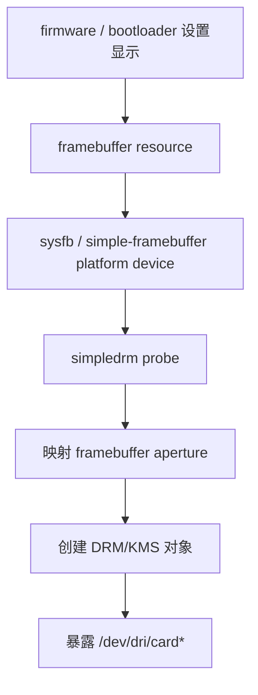

# Session 14：阅读 `simpledrm`

## 目标

理解 `simpledrm` 如何接管 firmware 提供的 framebuffer，并与 `vkms` 对照理解不同“简单驱动”的职责边界。

## 核心问题

- `simpledrm` 与 `vkms` 的职责差异是什么？
- 它是如何处理 modeset 和 framebuffer 的？
- 为什么 `simpledrm` 更像启动早期显示交接，而不是完整 GPU 驱动？

## 学习内容

### 1. simpledrm 解决的是启动早期显示交接

`simpledrm` 和 `vkms` 都“简单”，但简单的方向完全不同。

`vkms` 是虚拟 KMS 设备，用来测试 KMS 语义。`simpledrm` 则是把 firmware 已经设置好的 framebuffer 接进 DRM 框架，让系统在真正 GPU 驱动接管前也能有显示输出。

它的关键前提是：

- firmware 或 bootloader 已经设置好显示模式。
- 屏幕上已经有一块 framebuffer 可供 scanout。
- `simpledrm` 接管的是这块已存在的内存和显示状态。
- 它不负责 GPU 渲染，也不负责复杂显示链路训练。

所以 `simpledrm` 更像“早期显示的 DRM 包装器”，不是完整 GPU 驱动。

### 2. firmware framebuffer 从哪里来

启动过程中，固件可能通过 EFI framebuffer、simple-framebuffer、device tree 或 platform 描述告诉内核：

- framebuffer 的物理地址。
- 宽高。
- stride。
- 像素格式。
- 色彩位域。

`simpledrm` 作为 platform driver，读取这些资源并把它包装成 DRM/KMS 设备。

粗路径可以这样画：



读源码时，先找它如何获取 resource，再看它如何创建 KMS 对象。

### 3. aperture handover：为什么要移除旧 framebuffer

当真正的 GPU 驱动加载时，它可能也要控制同一块显示硬件或 framebuffer aperture。为了避免两个驱动同时控制同一片显示资源，Linux 有 aperture handover 机制。

你会在相关路径里看到“移除 conflicting framebuffer”这类逻辑。它的直觉是：

```text
simpledrm 临时使用 firmware framebuffer
    -> 真正 GPU 驱动加载
    -> 内核移除冲突的 simpledrm/fbdev 设备
    -> 真正驱动接管显示硬件
```

这解释了为什么 `simpledrm` 经常出现在启动早期，而不是长期承担完整显示驱动职责。

### 4. simple display pipe helper 做了什么

`simpledrm` 的显示能力很有限，因此可以使用 simple display pipe helper 把 connector、crtc、plane 这一套简化成一条显示管线。

你可以把它理解成：

```text
一条固定显示管线
    -> 一个 primary plane
    -> 一个 crtc
    -> 一个 connector
    -> 用 helper 处理大量通用 KMS 逻辑
```

伪代码形式：

```c
drm_simple_display_pipe_init(dev, &pipe,
                             &pipe_funcs,
                             formats, nr_formats,
                             NULL,
                             connector);
```

真实调用参数随内核版本和驱动实现略有差异，但阅读重点是：驱动不需要分别手写完整 plane/crtc 初始化和大量 atomic helper 回调，而是用 simple pipe 表达“我只有一条简单显示路径”。

### 5. simpledrm 和 vkms 对比

可以用下面的表记：

| 维度 | `vkms` | `simpledrm` |
| --- | --- | --- |
| 是否有真实 framebuffer | 软件模拟 | firmware 提供 |
| 是否驱动真实 GPU 渲染 | 否 | 否 |
| 主要价值 | 测试 KMS/atomic/CRC | 启动早期显示 |
| vblank 来源 | 软件模拟 | 依赖简单显示模型 |
| 是否长期接管硬件 | 通常作为虚拟设备 | 常被真正 GPU 驱动替换 |
| 最适合学习 | KMS 对象和 helper | firmware framebuffer 到 DRM 的交接 |

这个对比能帮你建立一个重要边界：能显示画面，不代表驱动了 GPU 渲染；能注册 DRM 设备，也不代表具备完整显存、提交和调度能力。

### 6. simpledrm 里的内存访问

`simpledrm` 处理的是已经存在的 framebuffer aperture。驱动需要把这片资源映射出来，并允许 KMS framebuffer 更新。

简化理解：

```c
resource_size_t start = res->start;
resource_size_t size = resource_size(res);

screen_base = devm_ioremap_wc(dev, start, size);
if (!screen_base)
    return -ENOMEM;
```

这里通常会使用 write-combine 映射优化 CPU 写 framebuffer 的性能。注意这仍然不是普通 `malloc` 内存，而是 firmware/hardware 暴露的 framebuffer 区域。

### 7. 本节实践：画 simpledrm 接管路径

建议按下面模板记录：

```text
platform driver 入口：
匹配方式：
framebuffer resource 来源：
像素格式解析：
framebuffer aperture 映射：
simple display pipe 初始化：
connector/helper：
fbdev emulation 是否启用：
aperture conflict removal：
remove/shutdown 路径：
```

阅读时始终带着问题：这一步是在“接管已有 framebuffer”，还是在“驱动真实 GPU 硬件”？多数情况下，`simpledrm` 做的是前者。

## 建议源码入口

- `drivers/gpu/drm/tiny/simpledrm.c`
- `drivers/gpu/drm/drm_simple_kms_helper.c`
- `include/drm/drm_simple_kms_helper.h`
- `drivers/video/fbdev/core/`

## 建议输出

- `simpledrm` init 流程图
- 与 `vkms` 的对比笔记

## 完成标准

- 能解释 `simpledrm` 的输入资源来自哪里。
- 能说清 `simpledrm` 和 `vkms` 在显示模型、硬件依赖和调试价值上的差异。
- 能画出 firmware framebuffer 被注册成 DRM 设备的大致路径。

## 关联 Lab

- [Lab 14：阅读 `simpledrm`](../../labs/lab-14-read-simpledrm/README.md)

## 下一步

进入 Session 15，开始阅读更接近真实硬件的移动 GPU 驱动。
