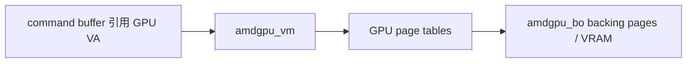

# Session 17：阅读 `amdgpu` 显存管理

## 目标

聚焦 `amdgpu` 的 BO、VRAM/GTT、GPU VM、对象迁移、eviction 和 shrinker 机制。

## 核心问题

- `amdgpu` 如何管理 BO、VM 和地址空间？
- 什么时候会发生迁移、回收和驱逐？
- TTM 在 `amdgpu` 里具体承担哪些工作？

## 学习内容

### 1. amdgpu 显存管理为什么值得单独学

`amdgpu` 是学习复杂显存管理的好材料，因为它把很多主题集中到一起：

- GEM 对象。
- TTM buffer object。
- VRAM、GTT、system memory。
- visible VRAM 和 BAR aperture。
- BO placement、pin、eviction、migration。
- GPU VM 和页表更新。
- dma-buf 共享和 fence 同步。

这一节不要试图读完整个 AMD 驱动，只聚焦一个问题：一个 BO 如何被创建、放置、映射进 GPU 地址空间，并在内存压力下迁移或驱逐。

### 2. 先分清 VRAM、GTT、system memory

在 `amdgpu` 里常见内存域可以先这样理解：

- VRAM
  GPU 本地显存，GPU 访问快。独显上通常是板载显存。

- visible VRAM
  CPU 通过 PCIe BAR 能直接访问到的一段 VRAM 窗口。不是所有 VRAM 都一定对 CPU 直接可见。

- GTT
  Graphics Translation Table 相关域，通常指 GPU 通过页表访问 system memory 的路径。

- system memory
  普通系统内存，CPU 访问自然，GPU 访问需要映射。

不同 BO 的理想位置不同：

```text
render target / texture       -> 倾向 VRAM
CPU frequent upload buffer    -> 倾向 GTT/system memory
scanout framebuffer           -> 需要满足显示硬件约束
command buffer                -> 需要 GPU 可访问且提交路径友好
```

placement 不是静态答案，而是驱动根据用途、压力和硬件限制不断调整的结果。

### 3. amdgpu_bo、GEM、TTM 的关系

可以用抽象模型理解：

```c
struct amdgpu_bo {
    struct ttm_buffer_object tbo;
    struct ttm_bo_kmap_obj kmap;
    struct list_head shadow_list;
    /* amdgpu private fields */
};
```

具体结构随内核版本会变化，但核心关系是：

- DRM/GEM 负责用户态 handle、mmap、PRIME 等公共接口。
- TTM 负责复杂显存放置、迁移和 eviction。
- `amdgpu_bo` 把 AMD 私有状态接到这些公共框架上。

读代码时要找对象转换函数，例如 `gem_to_amdgpu_bo`、`ttm_to_amdgpu_bo` 一类 helper。它们本质上都是 Session 02 的 `container_of` 思想。

### 4. BO 创建到 placement 的粗路径

用户态创建 BO 后，内核大致要做：

```text
create ioctl
    -> 解析 size/domain/flags
    -> 创建 GEM/TTM/amdgpu_bo
    -> 选择 placement
    -> 初始化 reservation object
    -> 创建 handle 返回用户态
```

简化伪代码：

```c
ret = amdgpu_bo_create(adev, size, alignment, domain,
                       flags, type, resv, &bo);
if (ret)
    return ret;

ret = drm_gem_handle_create(file, &bo->tbo.base, &handle);
```

阅读时重点记录：

- 用户态 flags 如何影响 domain。
- placement 列表在哪里构造。
- 对象什么时候被 pin。
- handle 创建后，原始引用如何释放。

### 5. GPU VM：让命令用 GPU VA 访问 BO

BO 创建出来还不等于 GPU 命令能访问它。GPU 需要在某个 VM 地址空间里看到这个 BO。

粗路径：

```text
BO
    -> 选择 GPU virtual address
    -> 建立 VM mapping
    -> 更新 GPU page table
    -> command buffer 使用 GPU VA
```

可以用图表示：



这也是为什么 `amdgpu_vm.c` 是本节核心入口。你不需要第一轮读懂每个页表层级，但要知道：

- VM 属于哪个进程/上下文。
- BO 何时 bind 到 VM。
- 页表更新本身也可能需要 GPU 执行或同步。
- VM fault 日志能反推哪个地址访问失败。

### 6. Eviction、migration 和 shrinker

显存不是无限的。当 VRAM 压力大时，驱动可能需要把 BO 从 VRAM 迁移到 GTT/system memory，或者驱逐暂时不用的对象。

关键概念：

- eviction：为了腾出空间，把对象赶出当前内存域。
- migration：对象在不同内存域之间移动。
- pin：对象被固定，不能随意迁移，例如 scanout 或某些页表对象。
- shrinker：内核内存压力下回收可释放资源的机制。

简化流程：

```text
需要分配 VRAM
    -> 空间不足
    -> TTM 选择可驱逐 BO
    -> 等待 BO fence
    -> 迁移到 GTT/system
    -> 新 BO 获得 VRAM
```

这里 fence 很关键：不能迁移一个 GPU 正在写的 BO，除非正确等待或处理同步。

### 7. 本节实践：追一个 BO 的“地址身份”

记录模板：

```text
BO 创建 ioctl：
amdgpu_bo 创建函数：
GEM handle 创建：
TTM object：
placement/domain：
是否 pin：
CPU mmap/vmap 路径：
GPU VM bind 路径：
页表更新入口：
eviction/migration 入口：
释放路径：
```

如果有 AMD 真机，可以补充：

```bash
sudo cat /sys/kernel/debug/dri/0/amdgpu_vram_mm
sudo cat /sys/kernel/debug/dri/0/amdgpu_gtt_mm
```

debugfs 节点名称和编号会因环境变化，实际以 `/sys/kernel/debug/dri/` 下存在的节点为准。

## 建议源码入口

- `drivers/gpu/drm/amd/amdgpu/amdgpu_object.c`
- `drivers/gpu/drm/amd/amdgpu/amdgpu_vm.c`
- `drivers/gpu/drm/amd/amdgpu/amdgpu_ttm.c`
- `drivers/gpu/drm/amd/amdgpu/amdgpu_gem.c`
- `drivers/gpu/drm/ttm/`

## 建议输出

- VM / BO 笔记
- 显存管理路径图

## 完成标准

- 能解释 `amdgpu_bo`、TTM BO 和 GEM object 的关系。
- 能画出一个 BO 从创建到进入 GPU VM 的粗路径。
- 能说明哪些路径只是源码可读，哪些需要 AMD 真机观察 `debugfs` 或日志。

## 关联 Lab

- [Lab 17：阅读 `amdgpu` 显存管理](../../labs/lab-17-read-amdgpu-memory/lab-17-read-amdgpu-memory.md)

## 下一步

进入 Session 18，在显存对象基础上继续追命令提交、调度和 fence。
