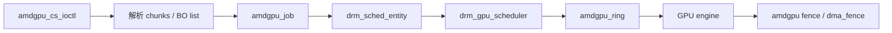

# Session 18：阅读 `amdgpu` 命令提交和调度

## 目标

理解 `amdgpu` 中命令提交、IB、ring、scheduler、fence 和完成回收路径如何协作。

## 核心问题

- 提交请求如何进入调度器？
- fence 如何跟随提交、完成和回收？
- 驱动如何从用户态 command submission 走到硬件 ring？

## 学习内容

### 1. 从显存对象走到命令提交

Session 17 解决的是“命令要访问的对象在哪里”。Session 18 解决的是“命令怎样被 GPU 执行”。

`amdgpu` 的命令提交路径可以先粗略记成：

```text
用户态 command submission ioctl
    -> 解析 chunks
    -> 查找 BO list
    -> 处理依赖 fence/syncobj
    -> 创建 job 和 IB
    -> 选择 ring/entity
    -> 推入 DRM scheduler
    -> backend emit 到硬件 ring
    -> GPU 完成后 signal fence
```

本节重点是路径，不是 AMD 指令包细节。

### 2. IB、ring、job、entity、scheduler 分别是什么

先把几个词分清：

- IB, Indirect Buffer
  一段 GPU 命令 buffer。硬件 ring 里可以放指向 IB 的命令，让 GPU 去执行这段命令。

- ring
  某个硬件 engine 的提交环，例如 graphics、compute、SDMA ring。

- job
  驱动提交给 scheduler 的一个工作单元，里面包含 IB、依赖、目标 ring、fence 等。

- entity
  scheduler 里的提交实体，通常和上下文、优先级或队列相关。

- DRM scheduler
  公共调度框架，负责依赖、排队、timeout、提交回调。

关系可以画成：



### 3. cs ioctl 的参数解析思路

`amdgpu_cs_ioctl` 里会处理用户态传入的多个 chunk。chunk 可以携带不同类型的信息，例如 IB、依赖、同步、BO list 等。

抽象伪代码：

```c
static int amdgpu_cs_ioctl(struct drm_device *dev, void *data,
                           struct drm_file *filp)
{
    struct drm_amdgpu_cs *cs = data;
    struct amdgpu_cs_parser parser;
    int ret;

    ret = amdgpu_cs_parser_init(&parser, cs, filp);
    if (ret)
        return ret;

    ret = amdgpu_cs_parser_bos(&parser);
    if (ret)
        goto out;

    ret = amdgpu_cs_submit(&parser);

out:
    amdgpu_cs_parser_fini(&parser, ret, true);
    return ret;
}
```

真实函数组织会随内核版本变化，但阅读点固定：

- parser 结构保存了哪些临时状态。
- BO list 在哪里解析和验证。
- 用户态 chunk 里的地址如何安全复制。
- IB 信息如何进入 job。
- 失败路径如何释放引用。

### 4. BO list 和依赖为什么在 submit 里

命令提交不能只交一个 command buffer，因为内核必须知道这批命令会访问哪些 BO。

BO list 的作用包括：

- 查找用户态 handle 对应的内核 BO。
- 确保 BO 在执行期间不会被释放。
- 收集这些 BO 上已有的 fence 作为依赖。
- 必要时 validate placement 或建立 VM 映射。
- 在提交完成后把新的 fence 挂回相关 BO。

这就是显存管理和提交路径交汇的地方。

### 5. DRM scheduler 如何调用驱动后端

公共 scheduler 并不知道 AMD ring 细节。它通过回调把 job 交给驱动：

```c
static const struct drm_sched_backend_ops amdgpu_sched_ops = {
    .run_job = amdgpu_job_run,
    .timedout_job = amdgpu_job_timedout,
    .free_job = amdgpu_job_free,
};
```

可以这样理解：

- `run_job`
  依赖满足后，真正把 job 提交到硬件 ring。

- `timedout_job`
  job 超时，进入 hang/reset 相关路径。

- `free_job`
  job 生命周期结束，释放资源。

这三个回调是从正常提交走向故障恢复的桥，Session 19 会继续用到。

### 6. Fence 如何贯穿提交和完成

一次 submit 通常产生一个 out fence。它会被用于：

- 用户态等待。
- 后续 submit 的输入依赖。
- BO reservation object 的同步。
- scheduler 判断 job 完成。
- 错误或 reset 时通知等待者。

简化路径：

```text
创建 job fence
    -> job 入队
    -> run_job 写 ring
    -> GPU 执行 IB
    -> 硬件 seqno 前进 / IRQ
    -> amdgpu fence 处理
    -> dma_fence_signal
```

读 `amdgpu_fence.c` 时，重点看硬件完成信息如何转成 `dma_fence_signal`。这就是“硬件做完了”和“内核等待者醒来”之间的桥。

### 7. 本节实践：画 cs ioctl 的函数链

建议用命令先定位：

```bash
rg -n "amdgpu_cs_ioctl|amdgpu_cs_submit|amdgpu_job_run|timedout_job|dma_fence_signal" drivers/gpu/drm/amd/amdgpu drivers/gpu/drm/scheduler
```

记录模板：

```text
用户态 ioctl：
内核入口：
parser 结构：
chunk 类型：
BO list 解析：
依赖 fence 解析：
job 创建：
IB 保存位置：
scheduler entity：
run_job 回调：
ring 提交函数：
fence 创建：
fence signal：
timeout 回调：
释放路径：
```

做完这张图，后面看 hang、reset、page fault 时，你会知道故障是从哪条正常路径偏离出去的。

## 建议源码入口

- `drivers/gpu/drm/amd/amdgpu/amdgpu_cs.c`
- `drivers/gpu/drm/amd/amdgpu/amdgpu_job.c`
- `drivers/gpu/drm/amd/amdgpu/amdgpu_ring.c`
- `drivers/gpu/drm/amd/amdgpu/amdgpu_fence.c`
- `drivers/gpu/drm/scheduler/`

## 建议输出

- scheduler / fence 笔记
- 命令提交流程图

## 完成标准

- 能画出 `amdgpu` 从 ioctl 到 scheduler 再到 ring 的路径。
- 能解释 fence 在提交完成和资源释放中的作用。
- 能指出一个 job timeout 或错误传播的后续入口。

## 关联 Lab

- [Lab 18：阅读 `amdgpu` 命令提交和调度](../../labs/lab-18-read-amdgpu-submission/lab-18-read-amdgpu-submission.md)

## 下一步

进入 Session 19，基于提交和 fence 路径继续看 page fault、hang 和 reset。
