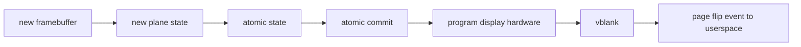

# Session 20：Page flip 与显示输出

## 目标

理解显示输出、page flip、vblank、plane state 和显示控制器在驱动中的协作方式。真实显示链路验证建议使用真机。

## 核心问题

- 一次 page flip 是如何从提交走到显示控制器的？
- vblank 为什么对显示同步如此关键？
- atomic commit、framebuffer 和用户态 page flip event 如何连起来？

## 学习内容

### 1. Page flip 的本质

page flip 不是“把像素复制到屏幕”。它更准确地说是：让显示控制器从下一帧开始扫描另一块 framebuffer。

双缓冲场景下：

```text
front buffer：当前正在显示
back buffer ：GPU 正在渲染下一帧
渲染完成后：请求 page flip
vblank 到来：显示控制器切到 back buffer
```

这样可以避免在屏幕扫描过程中换 buffer 导致撕裂。

### 2. 显示路径里的几个对象

一次 page flip 至少牵涉这些概念：

- framebuffer
  KMS 对象，描述像素 buffer 的格式、尺寸、pitch、modifier 和 BO。

- plane state
  plane 本次要显示哪个 framebuffer，显示位置和裁剪区域是什么。

- crtc state
  显示时序、active 状态、event 等。

- vblank
  安全切换显示状态的重要时序边界。

- page flip event
  内核通知用户态“这次 flip 已经生效或完成”的事件。

用图表示：



### 3. Legacy page flip 和 atomic commit 的关系

传统接口里有 `drmModePageFlip` 这类 page flip 调用。atomic 接口里，page flip 可以表达成一次 plane 的 `FB_ID` 更新：

```c
drmModeAtomicReq *req = drmModeAtomicAlloc();

drmModeAtomicAddProperty(req, plane_id, prop_fb_id, new_fb_id);
drmModeAtomicAddProperty(req, plane_id, prop_crtc_id, crtc_id);

drmModeAtomicCommit(fd, req,
                    DRM_MODE_ATOMIC_NONBLOCK |
                    DRM_MODE_PAGE_FLIP_EVENT,
                    user_data);
```

内核侧会把它变成 plane state 的变化，然后通过 atomic check/commit 路径应用。

### 4. framebuffer 不是 BO 本身

一个常见误解是把 framebuffer 和 buffer object 混为一谈。

更准确的关系是：

```text
GEM/BO
    -> 实际像素存储
drm_framebuffer
    -> KMS 对这块像素存储的解释
       包括 width/height/format/pitch/modifier/planes
```

同一块底层 BO 可以被包装成 framebuffer，才能被 KMS plane scanout。创建 framebuffer 时，驱动要检查：

- format 是否支持。
- pitch 是否合法。
- modifier 是否支持。
- buffer 是否能被 scanout。
- 多平面格式的每个 plane offset/stride 是否正确。

### 5. vblank event 到用户态

用户态请求 page flip event 后，通常会通过 DRM event 机制收到通知。应用可能用 `poll` 等待 fd 可读，再 `read` 事件。

简化用户态：

```c
drmEventContext ev = {
    .version = DRM_EVENT_CONTEXT_VERSION,
    .page_flip_handler = on_page_flip,
};

drmModePageFlip(fd, crtc_id, fb_id,
                DRM_MODE_PAGE_FLIP_EVENT, user_data);

while (running) {
    poll(&pfd, 1, -1);
    drmHandleEvent(fd, &ev);
}
```

内核侧大致是：

```text
commit 保存 event
    -> vblank 到来或 flip 完成
    -> drm_crtc_send_vblank_event
    -> drm_read / poll 唤醒用户态
```

### 6. 真机和 vkms/QEMU 的差异

`vkms` 很适合观察 atomic、plane、CRC、vblank 语义，但它没有真实显示链路。真机上还会多出：

- link training。
- display clock 和 PLL。
- bandwidth watermark。
- power saving。
- panel self refresh。
- MST、DSC、HDR、color management。
- 热插拔和 EDID。

所以本节可以分两层学习：

- 用 `vkms`/QEMU 理解通用 KMS 和 event 路径。
- 用真机验证真实显示控制器、connector、vblank、hotplug 和硬件限制。

### 7. 本节实践：追一次 flip

源码定位：

```bash
rg -n "drm_mode_page_flip_ioctl|DRM_MODE_PAGE_FLIP_EVENT|drm_crtc_send_vblank_event|atomic_commit" drivers/gpu/drm
```

记录模板：

```text
用户态入口：legacy page flip / atomic commit
framebuffer 创建入口：
plane state 更新：
atomic check：
atomic commit：
event 保存位置：
vblank handler：
event 发送位置：
用户态 read/poll 返回：
目标驱动 plane/crtc 回调：
```

完成后你应该能讲清楚：为什么“GPU 渲染完成”和“用户态收到 page flip event”不是同一个完成点。

## 建议源码入口

- `drivers/gpu/drm/drm_atomic.c`
- `drivers/gpu/drm/drm_atomic_helper.c`
- `drivers/gpu/drm/drm_vblank.c`
- `drivers/gpu/drm/drm_plane.c`
- `drivers/gpu/drm/drm_framebuffer.c`
- 目标驱动中的 plane/crtc/commit helper 实现。

## 建议输出

- KMS / vblank 笔记
- page flip 路径图

## 完成标准

- 能画出用户态请求到 page flip event 的基本路径。
- 能解释 vblank 为什么是显示同步的重要边界。
- 能说明 vkms/QEMU 和真机显示链路在实验能力上的差异。

## 关联 Lab

- [Lab 20：Page flip 与显示输出](../../labs/lab-20-page-flip-and-display/README.md)

## 下一步

进入 Session 21，系统整理 trace、debugfs、perf 和 DRM debug log 的调试方法。
